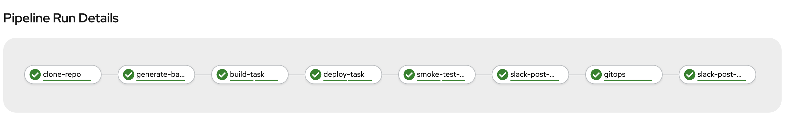
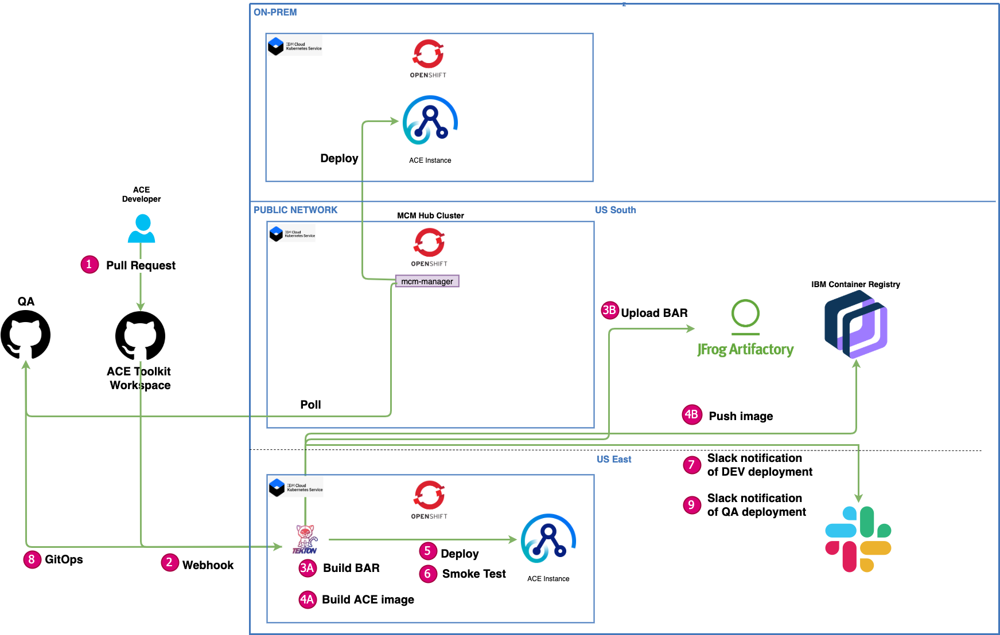
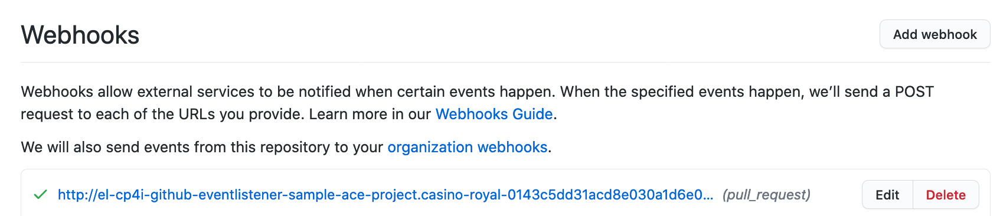
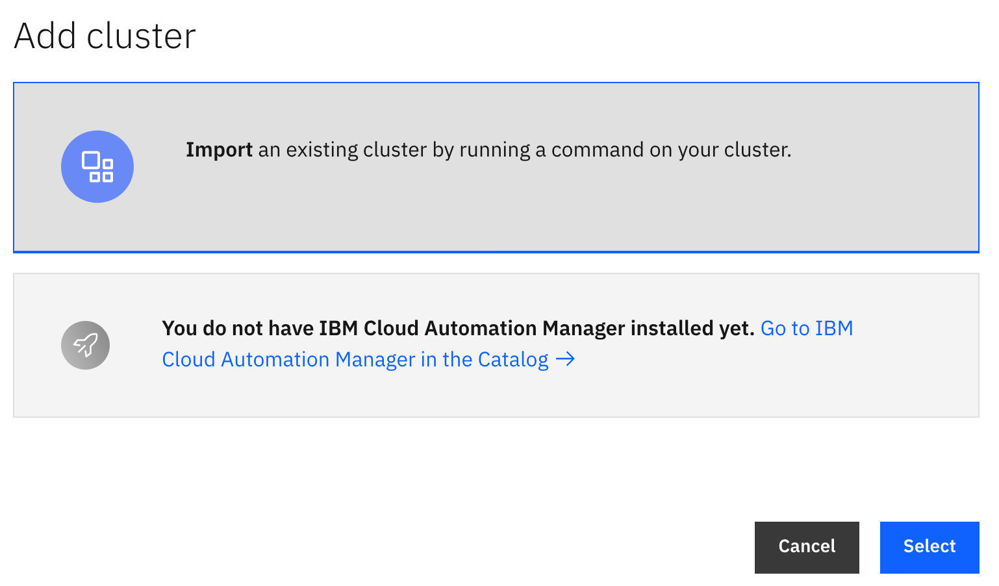
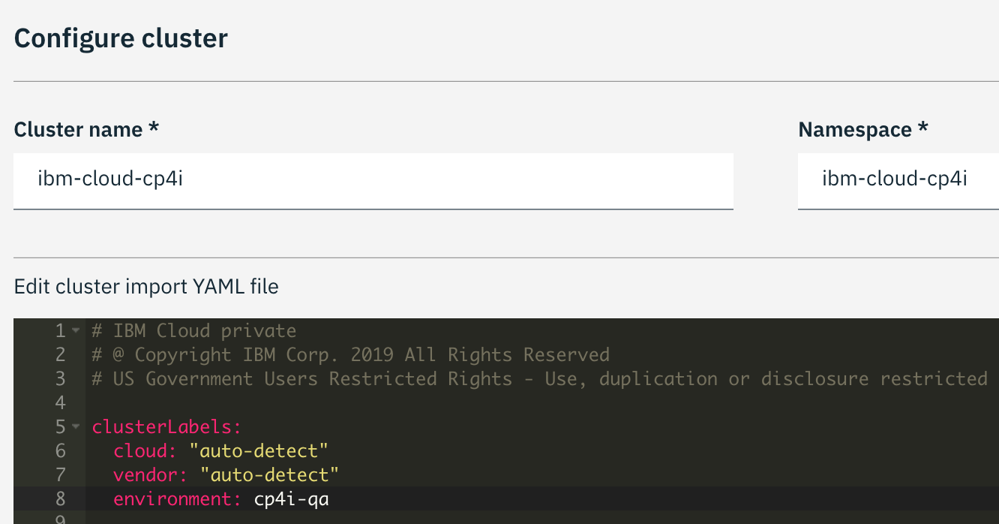

# Configure a CI (Tekton) and CD (CloudPak for MultiCloud Management) pipeline for App Connect Enterprise (ACE) deployments using a gitops workflow

This [README](../ace-tekton-pipelines/README.md) provides a working example of a Kubernetes native pipeline for App Connect Enterprise (ACE) deployments.  The pipeline involves using [Tekton](https://github.com/tektoncd/pipeline) for Continuous Integration and CloudPak for MultiCloud Managmeent v1.3 for Continuous Delivery.  The application model provides flexibility in terms of how deployments can be done.  In this specific tutorial, we will be using the CRDs to support a gitops workflow.





## Table of Contents
- [Overview of Pipeline](TBD)
- [Environment](TBD)
- [Pre-requisites](TBD)
- [Instructions](TBD)
  - [Setup](TBD)
  - [Configure Tekton Pipeline & Tasks](TBD)
  - [Configure Webhook](TBD)
  - [Configure CP4MCM to support gitops workflow ](TBD)
  - [Trigger pipeline](TBD)


## Pipeline Flow
The [draw.io](https://app.diagrams.net/) diagram below show the end to end flow of a sample ACE pipeline.


- **Step 1**: ACE developer working on a user story is code complete and submits a pull request for review.
- **Step 2**: Once the pull request has been approved and merged, this will fire off the webhook to trigger the Tekton pipeline.
- **Step 3A**: The first stage of the pipeline will clone the git repository of the ACE Toolkit project and compile a broker archive or BAR file.  
- **Step 3B**: The BAR file will be uploaded to JFrog Artifactory and backed up.  Alternative repositories like Nexus can be used as well.
- **Step 4A**: Create a custom ACE image using the dockerfile in the git repository, including the compiled BAR file.
- **Step 4B**: Push the custom ACE image into a centralized image registry.
- **Step 5**: Deploy an instance of the ACE IntegrationServer using the newly built image to the `DEV` environment.
- **Step 6**: Verify the ACE deployment has successfully rolled out and verify the application's REST endpoint is returning a 200.
- **Step 7**: Post a notification to Slack once the `DEV` deployment is complete.  The notification can be configured to only to inform users when there is a failure.
- **Step 8**: Update the github repository which represents the desired state of your application in the `QA` environment.
- **Step 9**: Post a notification to Slack once the `QA` deployment is complete.


## Environment Setup
For this demo, two OpenShift 4.x clusters are used.  
  - **Hub Cluster**: OpenShift cluster 4.x + CloudPak for MultiCloud Management v1.3.
  - **Environment Cluster**: OpenShift cluster 4.x + CloudPak for Integration 2020.2.1.  Different namespaces will be used to represent the `DEV` and `QA` environments.
  - Required Operator:
    - `OpenShift Pipelines Operator` - Installs Tekton and the required CRDs to run the pipeline. This operator can be installed on the cluster where the pipeline(s) will be executed.
  - IBM Garage Cloud Native Toolkit:
    - The [Toolkit](https://cloudnativetoolkit.dev/) installation can be customized to install a number of tools including Artifactory.


## Pre-requisites
To complete this tutorial, the following command line tools will be required:
  - `git`
  - `docker`
  - `oc` - [OpenShift CLI](https://docs.openshift.com/container-platform/4.4/cli_reference/openshift_cli/getting-started-cli.html#installing-the-cli)
  - `tkn` - [Tekton CLI](https://github.com/tektoncd/cli)

The sample ACE Toolkit application is using a REST based subflow to call a backend microservice which will return a json object containing a list of items in an inventory database.


## Instructions
### Setup
1. Clone the repository containing the required yaml files:
```
git clone git@github.com:ibm-cloud-architecture/gse-devops.git
```

2. Fork the sample [ACE Toolkit workspace](https://github.com/ibm-cloud-architecture/devops-demo-sample-ace-project) repository.

3. Fork the sample [environment](https://github.com/ibm-cloud-architecture/devops-demo-cp4i-env) repository representing `QA` for example.

4. Generate a Github token.  Refer to this [link](https://docs.github.com/en/github/authenticating-to-github/creating-a-personal-access-token) for detailed instructions.

5. Generate an IBM Cloud API key.  Refer to this [link](https://cloud.ibm.com/docs/containers?topic=containers-images#other_registry_accounts) for detailed instructions.

6. [Optional] Generate a Slack Webhook.  Refer to this [link](https://slack.com/intl/en-ca/help/articles/115005265063-Incoming-webhooks-for-Slack#set-up-incoming-webhooks) for detailed instructions. This is only required if you want to set up notifications from your pipeline.  The instructions below assumes that the pipeline will be posting notifications to Slack.  This can be disabled by modifying the `pipeline` to remove references to the `Slack` tasks.

7. Configure the `cp4i-dev` project on the **Environment Cluster**.
    1. From a terminal window, log in to the OpenShift cluster.
    2. Create a namespace for the `DEV` environment.
    ```
    oc new-project cp4i-dev
    ```
    3. Update the `gse-devops/ace-tekton-pipelines/Secrets/github-access-token-secret.yaml` with the Base64 encoded value of the github username and token.
    4. Create a Secret for your github token.
    ```
    oc apply -f gse-devops/ace-tekton-pipelines/Secrets/github-access-token-secret.yaml -n cp4i-dev
    ```
    5. Create an image pull secret containing credentials to pull images from the private image registry.  In this tutorial, we will be using the IBM Container Registry managed service.  Substitute the IBM Cloud API key and any email address.
    ```
    oc -n cp4i-dev create secret docker-registry ibm-cr-pull-secret --docker-server=us.icr.io --docker-username=iamapikey --docker-password=<api_key_value> --docker-email=<email>
    ```
    6. Update the `gse-devops/ace-tekton-pipelines/Secrets/artifactory-secret.yaml` with the Base64 encoded value of Artifactory URL and admin password.  Artifactory is one of the default tools installed with the [IBM Garage Cloud Native Toolkit](https://cloudnativetoolkit.dev/).
    7. Create a Secret for the pipeline to access Artifactory.
    ```
    oc apply -f gse-devops/ace-tekton-pipelines/Secrets/artifactory-secret.yaml -n cp4i-dev
    ```
    8. [Optional] Update the `gse-devops/ace-tekton-pipelines/Secrets/slack-webhook-secret.yaml` with the Base64 encoded value of the Slack Webhook.
    9. Create a Secret of your Slack Webhook.
    ```
    oc apply -f gse-devops/ace-tekton-pipelines/Secrets/slack-webhook-secret.yaml -n cp4i-dev
    ```

8. Configure the `cp4i-qa` project on the **Environment Cluster**.
  1. From a terminal window, log in to the OpenShift cluster.
  2. Create a namespace for the `QA` environment.
  ```
  oc new-project cp4i-qa
  ```
  3. Create an image pull secret containing credentials to pull images from the private image registry.  In this tutorial, we will be using the IBM Container Registry managed service.
  ```
  oc -n cp4i-qa create secret docker-registry ibm-cr-pull-secret --docker-server=us.icr.io --docker-username=iamapikey --docker-password=<api_key_value> --docker-email=<email>
  ```

### Configure Tekton Pipeline & Tasks on the **Environment Cluster**.
1. From a terminal window, log in to the OpenShift cluster.
2. Edit `gse-devops/ace-tekton-pipelines/tekton-yamls/Tasks/cp4i-gitops-task.yaml` and replace the two instances of `ibm-cloud-architecture` with the Github Org that the `devops-demo-cp4i-env` repository exists in.  
3. Create the Tekton Pipelines and Tasks.
```
# Create Tekton Tasks
oc apply -f gse-devops/ace-tekton-pipelines/tekton-yamls/Tasks -n cp4i-dev
# Create Tekton PipelineRun
oc apply -f gse-devops/ace-tekton-pipelines/tekton-yamls/Pipeline -n cp4i-dev
```

### Configure Webhook on the **Environment Cluster**
1. From a terminal window, log in to the OpenShift cluster.
2. Create a Tekton Trigger Webhook. The webhook will execute the pipeline upon the merge of a pull request.  An `EventListener`, `TriggerBinding` and `TriggerTemplate`resource will be created.
```
oc apply -f gse-devops/ace-tekton-pipelines/tekton-yamls/Webhook -n cp4i-dev
```
3. The `EventListener` resource will create result in the creation of a `Deployment` and `Service`.  Expose the service to generate a route.
```
oc expose svc el-cp4i-github-eventlistener -n cp4i-dev
```
4. Retrieve the `route` URL of the eventlistener.  
```
oc get routes el-cp4i-github-eventlistener -n cp4i-dev
```
4. Create a webhook on the forked [ACE Toolkit workspace](https://github.com/ibm-cloud-architecture/devops-demo-sample-ace-project) repository.  
  1. In a browser, go to the forked repository.
  2. Click on the `Settings` tab and select `Webhooks`.
  3. Click `Add webhook` and enter your Github password.
  4. Set the following:
  ```
  Payload URL = http://<Route of Eventlistener>
  Content type = application/json

  Which events would you like to trigger this webhook? = Let me select individual events
    Select only the checkbox for "Pull requests" and click Add Webhook.
  ```
  5. A webhook has now been set up.
  


### Configure CP4MCM to support gitops workflow on the **Hub Cluster**
1. Register the **Environment Cluster** (`OpenShift cluster 4.x + CloudPak for Integration 2020.2.1`) with the **Hub Cluster** (1OpenShift cluster 4.x + CloudPak for MultiCloud Management v1.3`).
  1. Log on to the `IBM Cloud for MultiCloud Management` console in a browser.
  2. Select the hamburger button on the top left corner and click on `Automate Infrastructure` > `Clusters`.
  3. Click the `Add cluster` button, select `Import an existing cluster by running a command on your cluster` and click `Select`.
  
  4. Provide a value for `Cluster name` and `Namespace`.
  5. Click the dropdown for `Edit cluster import YAML file` and  add the following label `environment: cp4i-qa` under `clusterLabels`.
  
  6. Click `Generate command` and copy the generated command.
  7. Log in to the **Environment Cluster** and execute the generated command.
2. From a terminal window, log in to the OpenShift Hub Cluster with CP4MCM.
3. Create a namespace for the `cp4i-qa` environment.
```
oc new-project cp4i-qa
```
4. Update the `gse-devops/ace-tekton-pipelines/cp4mcm-yamls/Channels.yaml` with the URL to the QA environment repository.
5. Create a `Channel` for the QA environment repository which was forked earlier.  The `Channel` type is `GitHub` so a deployable object will be generated by CP4MCM for the `IntegrationServer` resource.
```
oc apply -f gse-devops/ace-tekton-pipelines/cp4mcm-yamls/Channels.yaml
```
6. Create a `PlacementRule`.  This will allow CP4MCM to determine which cluster(s) to deploy an application to by matching labels.
```
oc apply -f gse-devops/ace-tekton-pipelines/cp4mcm-yamls/PlacementRules.yaml
```
7. Create a `Subscription`.  The subscription will deploy the resources in a `Channel` to the cluster(s) identified by a `PlacementRule`/
```
oc apply -f gse-devops/ace-tekton-pipelines/cp4mcm-yamls/Subscriptions.yaml
```
8. Create an `Application`.  The `Application` will group together different components of an application which CP4MCM will visualize using weavescope on the CP4MCM console.
```
oc apply -f gse-devops/ace-tekton-pipelines/cp4mcm-yamls/Application.yaml
```

### Trigger pipeline
To test the pipeline, create a pull request and merge it into the git repository forked from [ACE Toolkit workspace](https://github.com/ibm-cloud-architecture/devops-demo-sample-ace-project).  Once the pull request has been merged, a PipelineRun execution should start and can be viewed from the OpenShift Console in the `Pipelines` > `PipelineRuns` menu.
