# Configure a Kabanero Pipeline for Bluecompute

This [README](../bluecompute-ce-kabanero-pipelines/README.md) is a follow on to deploying `bluecompute-ce` on an OpenShift cluster and will focus on the following activities.  The screen captures provided are based on a Managed OpenShift 3.11 cluster with IBM Cloud Pak for Applications v3.0.1 running on IBM Cloud.  Tekton v0.5.2 is bundled into this version of the Cloud Pak for Application install.

1. Configure the BlueCompute Web app deployment to pull images from the IBM Container Registry.
2. Configure and manually validate a Kabanero CICD pipeline.
3. Configure a Tekton Webhook to trigger the Kabanero pipeline upon a push.


## Requirements:
- A deployed OpenShift cluster.
- Install Git CLI `git`, Docker CLI `docker`, Kubernetes CLI `kubectl`, and OpenShift CLI `oc`.


## Install Cloud Pak for Application:
For Managed OpenShift 3.x instances on IBM Cloud,

1. Log in to [IBM Cloud](https://cloud.ibm.com/) and go to the Catalog.
2. Select `Software` > `Cloud Pak for Applications`.
3. Select the target Red Hat OpenShift cluster to install the Cloud Pak on and enter or select a project.
4. Before the install can start, a pre-installation script must be run.  The script creates customized security context constraints and grants access to the service accounts that are required for Cloud Pak for Applications to install successfully. Click the `Run script` button to trigger the script and wait for it to complete successfully.
5. Select the checkbox under Summary on the right side of the page and click Install.
6. Check the logs to verify the install completes successfully.

Note: The [IBM Cloud Schematics](https://cloud.ibm.com/schematics/workspaces) service will have a workspace tracking the terraform install activity for the installation of the Cloud Pak.


## Deploy the `bluecompute-ce` application to the `kabanero` namespace
1. Follow the steps documented in these [instructions](../bluecompute-ce/README.md).  Ensure that your `oc` CLI are set to the `kabanero` project by `oc project kabanero` or add `-n kabanero` for any `oc` commands.  For step 2, the updated commands to set the Security Context Constraints (SCC) for the `default` Service Account are listed below.
```
oc adm policy add-scc-to-user anyuid system:serviceaccount:kabanero:default
oc adm policy add-scc-to-user privileged system:serviceaccount:kabanero:default
```
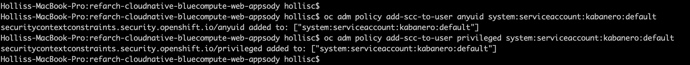


## Update the Web Deployment to pull images from IBM Container Registry instead of Dockerhub:
1. Create an API key for use by the service account to access the Registry.  Instruction are available in this [link](https://cloud.ibm.com/docs/iam?topic=iam-userapikey#create_user_key).

2. Validate the API key and push BlueCompute web docker image to the IBM Container Registry using your local Docker CLI.
```
# Log in to IBM Container Registry using the generated API key
docker login -u iamapikey -p <your_apikey> <registry_url>
    For namespaces set up in AP-North, use jp.icr.io
    For namespaces set up in AP-South, use au.icr.io
    For namespaces set up in EU-Central, use de.icr.io
    For namespaces set up in UK-South, use uk.icr.io
    For namespaces set up in US-South, use us.icr.io
```


3. Log in to [IBM Cloud](https://cloud.ibm.com/), select OpenShift and click on Registry. Then click on namespaces and then click on create namespace and create a new user.


4. Pull the BlueCompute web image from Dockerhub
```
docker pull ibmcase/bluecompute-web:0.6.0
```


5. Tag the image with the IBM Container Registry URL.
```
docker tag ibmcase/bluecompute-web:0.6.0 us.icr.io/<user>/bluecompute-web:0.6.0
```


6. Push the image to IBM Container Registry
```
docker push us.icr.io/<user>/bluecompute-web:0.6.0
```


 Verify the image appears in the IBM Container Registry.


7. Create an image pull secret with the API key.  Refer to this [link](https://cloud.ibm.com/docs/containers?topic=containers-images#other_registry_accounts) for detailed instructions.
```
# Create a pull image secret
kubectl create secret docker-registry <secret_name> --docker-server=<registry_URL> --docker-username=iamapikey --docker-password=<api_key_value> --docker-email=<docker_email>
```
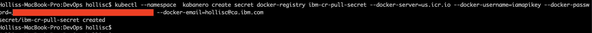

8. Update the default service account with the image pull secret.  Refer to this [link](https://cloud.ibm.com/docs/containers?topic=containers-images#use_imagePullSecret) for detailed instructions.
```
# Patch the default service account with the image pull secret
kubectl patch serviceaccount/default --type='json' -p='[{"op":"add","path":"/imagePullSecrets/-","value":{"name":"<image_pull_secret_name>"}}]'
```
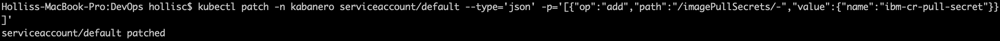

9. Update Bluecompute Web deployment with the image from IBM Container Registry.
  - From OpenShift console, click `kabanero` project, select Application > Deployments and click on `web`.
  - Select Actions > Edit YAML and an inline editor will appear.  Search for `image: 'ibmcase/bluecompute-web:0.6.0'` and update the image reference to the image you uploaded to the IBM Container Registry (ie. `image: 'us.icr.io/<user>/bluecompute-web:0.6.0'`). Click Save.
  - Verify the pod is able to pull the image successfully.  You can monitor the termination of the existing pod for the web application and creation of a new pod using `kubectl get pods -w`.


10. Refresh the `bluecompute` web application in your browser and verify that the application still loads correctly.

11. Delete the `web` Deployment, Service and Route.  We will deploy these resources using the Kabanero Pipeline and AppsodyApplication CRD.  Verify that the pod is terminated and the application no longer loads on the browser.
```
kubectl delete deployment web
kubectl delete service web
kubectl delete route web
```
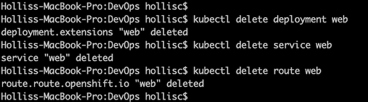


## Create Kabanero Pipeline:
For this activity, we will using a refactored `bluecompute-web` Github repository to use the out of the box [nodejs Appsody Stack](https://github.com/appsody/stacks/tree/master/incubator/nodejs) and [nodejs Kabanero Collection](https://github.com/kabanero-io/collections/tree/master/incubator/nodejs).  

Refer to this [post](../bluecompute-ce-kabanero-pipelines/Refactor-Application-Appsody-Stack.md) on how the Bluecompute Web repository was refactored to work with the kabanero/nodejs:0.2 stack.  An alternative option is to create a custom Appsody Stack - [link](https://appsody.dev/docs/stacks/create/).

1. Fork the updated [BlueCompute Web repo in Appsody format](https://github.com/hollisc/refarch-cloudnative-bluecompute-web-appsody) repository.  Browse to the BlueCompute Web repository and click on the Fork button on the top right corner. This will fork a repository under your own Git account.  The original `bluecompute-web` repository is [here](https://github.com/ibm-cloud-architecture/refarch-cloudnative-bluecompute-web/tree/spring) for reference.
2. Clone the git repository for the Kabanero Pipeline yamls.  
```
git clone git@github.com:ibm-cloud-architecture/gse-devops.git
cd DevOps
cd bluecompute-ce-kabanero-pipelines
```  
3. Verify oc cli is set to use `kabanero` project.
```
oc project
```
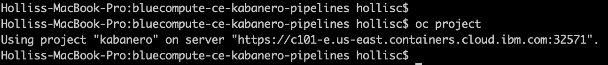
4. Create a push image secret.
```
# Create Kubernetes Secret
kubectl create secret generic ibm-cr-push-secret  --type="kubernetes.io/basic-auth" --from-literal=username=iamapikey --from-literal=password=<API Key>
# Add annotation to the secret:
kubectl annotate secret ibm-cr-push-secret tekton.dev/docker-0=us.icr.io
```
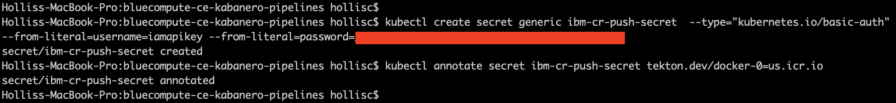
5. Update `kabanero-operator` service account with the push secret
  - Edit the `kabanero-operator` service account with `kubectl edit sa kabanero-operator` and add `ibm-cr-push-secret` as a mountable secret.
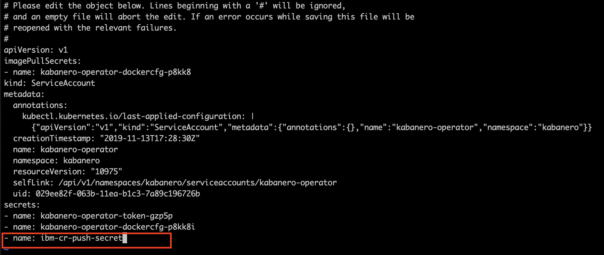
6. Update the `kabanero-operator` service account with the image pull secret created previously.  
```
# Patch the kabanero-operator service account with the image pull secret
kubectl patch serviceaccount/kabanero-operator --type='json' -p='[{"op":"add","path":"/imagePullSecrets/-","value":{"name":"<image_pull_secret_name>"}}]'
```
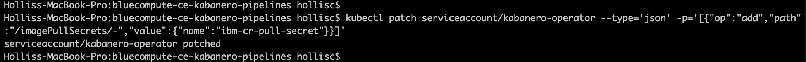
7. Create the PipelineResource resources.
  - From the cloned `DevOps` repository, modify `PipelineResources/bluecompute-web-pipeline-resources.yaml` to replace `<Docker Registry URL>/<user>/bluecompute-web-appsody` and `https://github.com/<Git Org>/refarch-cloudnative-bluecompute-web-appsody.git` values.  For those using the IBM Container Registry, the URL for the various regions listed below.
  ```
  For namespaces set up in AP-North, use jp.icr.io
  For namespaces set up in AP-South, use au.icr.io
  For namespaces set up in EU-Central, use de.icr.io
  For namespaces set up in UK-South, use uk.icr.io
  For namespaces set up in US-South, use us.icr.io
  ```
  - Create the git and image pipeline resources.
  ```
  kubectl apply -f PipelineResources/bluecompute-web-pipeline-resources.yaml
  ```

8. Verify the Tekton resources were created from the Tekton Dashboard.
  ```
  # Get Tekton Dashboard URL
  oc get route -n tekton-pipelines
  ```
  - PipelineResources
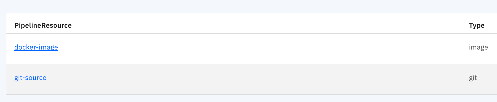
9. Manually run the Tekton Pipeline.
 - Let's validate the Kabanero Pipeline using a PipelineRun.  
 - Start the pipeline by running the command: `kubectl create -f PipelineRuns/bluecompute-web-pipeline-run.yaml`.  Note that the name of the pipelinerun resource is auto-generated (refer to metatdata.generateName property) so `kubectl apply` cannot be used otherwise an error will be thrown.
 - Description of the pod status during the execution of a Tekton pipeline.  
     * The `nodejs-manual-bluecompute-web-pr-j8mrq-build-task-*` pod is executing the build task.  It starts the pre-defined init containers followed by the steps defined in the Kabanero Nodejs Collection Build Task.
     * The `nodejs-manual-bluecompute-web-pr-j8mrq-deploy-task-*` pod is executing the deployment task.  It starts the init containers followed by the steps defined in the Kabanero Nodejs Collection Deploy Task.
     * Once the deployment is complete, a `web` pod is running and referencing the new image that was created and pushed to the IBM Container Registry.
     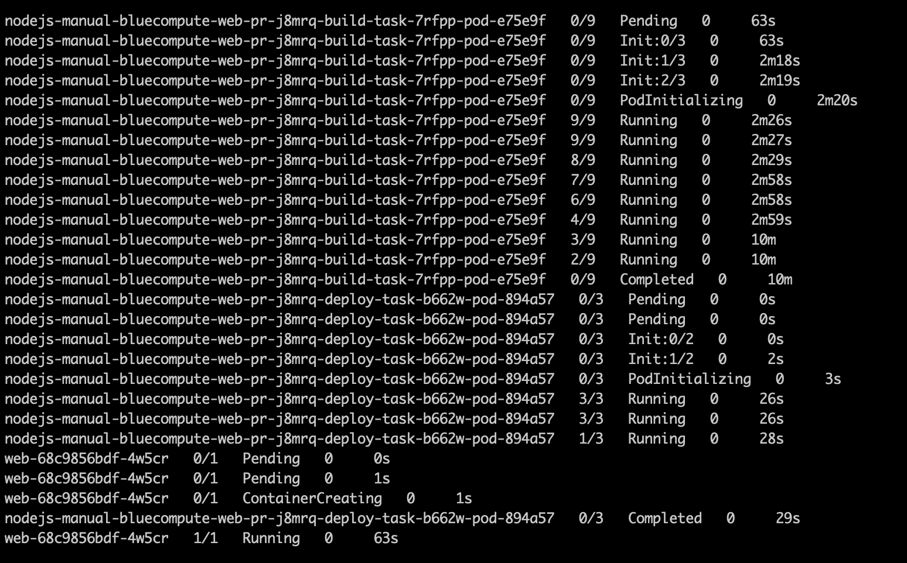
10. Validate the deployment of `bluecompute-web`.
 - Refresh the IBM Container Registry and you will notice that a new image `/<user>/bluecompute-web-appsody:latest` exists.  
 - Let's go ahead and retrieve the URL for the `web` application using `oc get route` and paste that into a browser.  
 - You will notice that the `bluecompute-web` application is not available, so what happened?  Although the `web` pod is running successfully, the `web` Service definition needs to be updated.  Run `oc get svc web -o yaml` to view the current Service in YAML format.  You will notice that both `port` and `targetPort` are set to `80`.  The application requires `targetPort` to be set to `8000`.  Modify the Service from the OpenShift console or using the `oc` CLI command `oc edit svc web` and then refresh your browser and the `bluecompute-web` application will load.    
 - :warning: In the [BlueCompute Web](https://github.com/hollisc/refarch-cloudnative-bluecompute-web-appsody) repository, the `app-deploy.yaml` defines the spec for an AppsodyApplication CRD.  This file is generated using the `appsody deploy --generate-only` command.  The pipeline uses this yaml to create an instance of the AppsodyApplication resource.  The Appsody Operator will then create a Deployment, Service and Route for the target application.  Currently, the `AppsodyApplication` CRD only supports the parameters defined in this [link](https://github.com/appsody/appsody-operator/blob/master/doc/user-guide.md#custom-resource-definition-crd).  An [enhancement request](https://github.com/appsody/appsody-operator/issues/181) has been opened to support `targetPort` as an optional parameter.


## Configure Tekton Github Webhook:
1. Generate and save the Github token.
 - Go to github.com/settings/tokens and click Generate new token.
 - Check the admin:repo_hook option and click Generate token.
2. Open the Tekton Dashboard in a browser and click on Webhooks item in the left hand menu and select "Add Webhook".
3. Create an `Access Token` by clicking on the `+` and specifying a name and the Github token generated in the previous step.
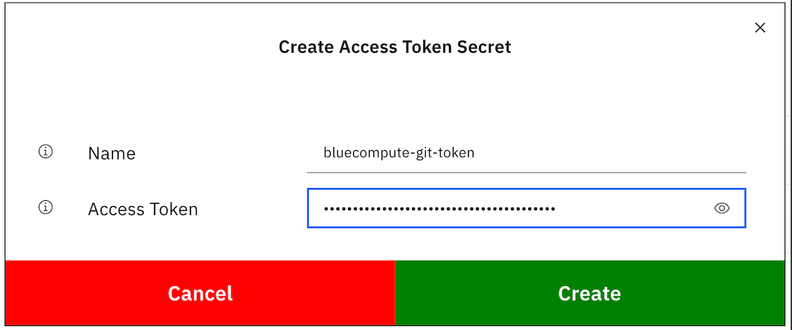
4. Fill in the fields similar to below but use your own Github repository and Docker Registry.  Click Create.
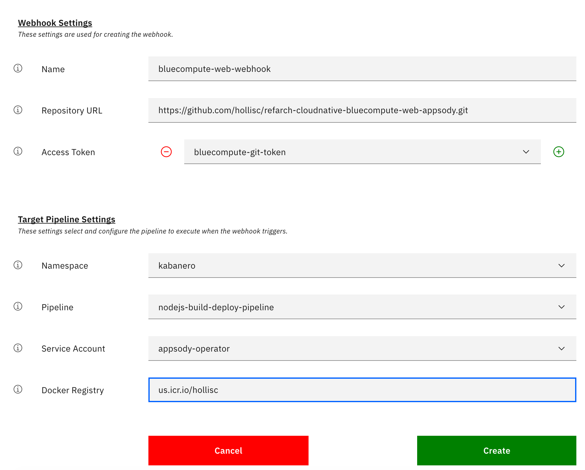
5. A Tekton Webhook has been configured.
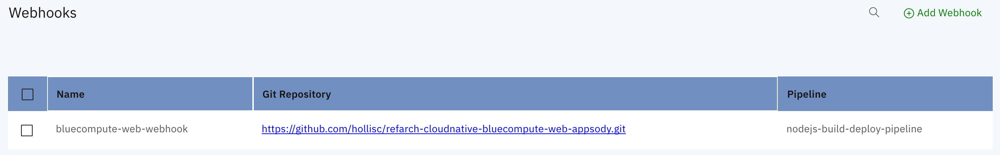


## Validate webhook by pushing in a change to the web application:

:warning: Currently there is an open bug related to timing issue that causes PipelineRuns to fail if the creation of the PipelineResources are not completed in time.  This is tracked via https://github.com/tektoncd/experimental/issues/240.

***
:heavy_exclamation_mark: As this tutorial is using the Appsody Stack, the Tekton Webhook triggers a PipelineRun with the `appsody-operator` service account.  The default permissions set for this service account does not have sufficient permission though and the pipelinerun will fail.  

To work around this, we will set the `appsody-operator` with the same permission as the `kabanero-operator` service account, which was used in the manual pipelinerun.  This service account has been set with clusteradmin access by default.  This should not be done in production and the service account should only be set with permissions required to execute the pipeline.
***

1. Update permission of `appsody-operator` service account.
  - Edit the clusterrolebinding for kabanero-operator `oc edit clusterrolebinding <clusterrolebinding name>` and update it to match what is highlighted in the red boxes.  In my particular cluster, the clusterrolebinding name is `cluster-admin-3`.
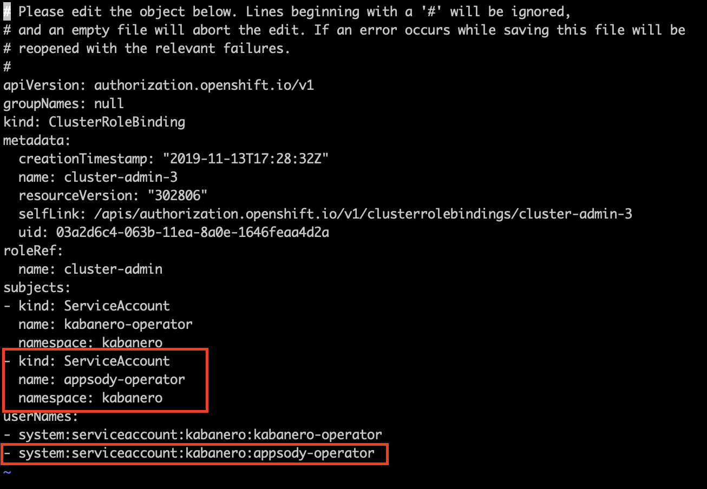  
2. Update `appsody-operator` with image pull and push secrets.
  - Edit the `kabanero-operator` service account with `kubectl edit sa appsody-operator` and add `ibm-cr-push-secret` as a mountable secret.
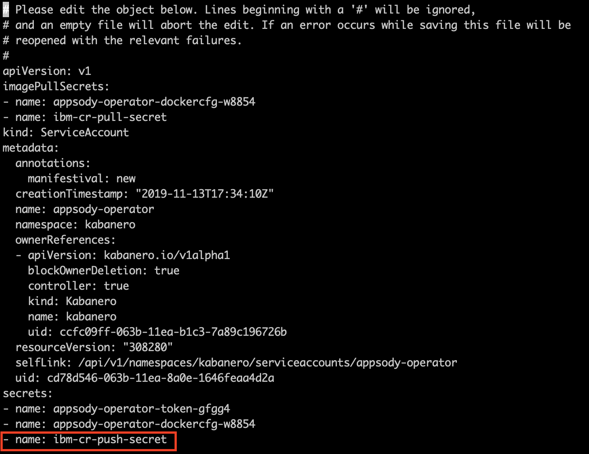
  - Update the `appsody-operator` service account with the image pull secret created previously.  
  ```
  # Patch the appsody-operator service account with the image pull secret
  kubectl patch serviceaccount/appsody-operator --type='json' -p='[{"op":"add","path":"/imagePullSecrets/-","value":{"name":"<image_pull_secret_name>"}}]'
  ```
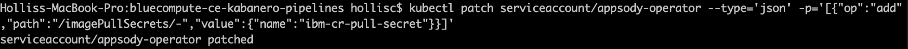
3. Clone the forked refarch-cloudnative-bluecompute-web-appsody github repository from earlier.
```
git clone git@github.com:<Github Org>/refarch-cloudnative-bluecompute-web-appsody.git
cd refarch-cloudnative-bluecompute-web-appsody
```
4. Make a change to the web application homepage and commit the change.
  - Edit the homepage (/public/resources/components/views/home.html) and save your change.
  - Verify your change is detected with `git status`
  - Commit your change `git commit -am "Update homepage"`
  - Push the change to the `master` branch `git push origin master`
  - Monitor the pods in the "bluecompute" project and verify a PipelineRun was triggered and a new `web` application pod is started.
  `kubectl get pods -w`

   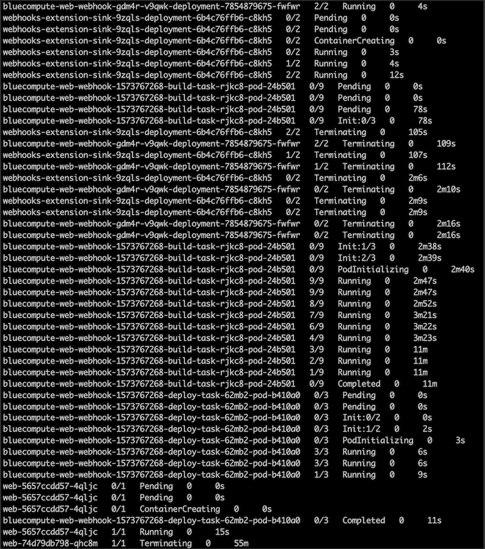
  - Alternatively, one can monitor the webhook triggered pipelinerun from the Tekton Dashboard as well.

      - PipelineRun View:
      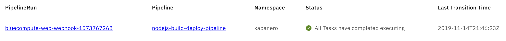
      - TaskRun View:
      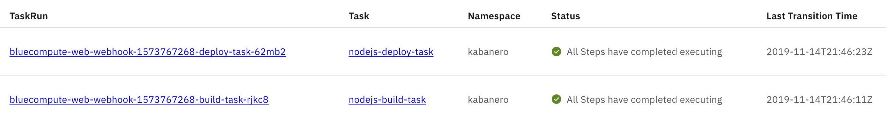


## Uninstall Cloud Pak for Application:
For Managed OpenShift 3.x instances on IBM Cloud,

1. Log in to [IBM Cloud](https://cloud.ibm.com/), click the hamburger button on the top right and select `Schematics`.
2. Select `Workspaces` and click on the Cloud Pak for Application installation workspace (ie. ibm-cp-application-MM-DD-YYYY).
3. Select `Actions` > `Destroy Resources` to start the uninstall.
4. Once the uninstall is complete, delete the workspace (`Actions` > `Delete Workspace`).

Note: Based on my recent testing, the Cloud Pak for Application projects still exist in the cluster even after the uninstall.  One can manually delete the projects from the OpenShift console (`istio-system`, `kabanero`, `kappnav`, `knative-eventing`, `knative-serving`, `knative-sources`, `openshift-pipelines`, `ta`).
