# Configure OpenShift Pipelines for Bluecompute

This [README](../../bluecompute-ce-openshift-pipelines/README.md) is a follow on to deploying `bluecompute-ce` on an OpenShift cluster and will focus on three activities:

1. Configure the BlueCompute Web app deployment to pull images from the IBM Container Registry.
2. Configure and manually validate a OpenShift Pipeline using S2I to build the image.
3. Configure a Tekton Webhook to trigger the pipeline upon a push.  
  :heavy_exclamation_mark: **For this tutorial, we will be using [Tekton Dashboard and Webhook Extension v0.3.0](https://github.com/tektoncd/dashboard/releases/tag/v0.3.0) which is based on [Tekton Triggers](https://github.com/tektoncd/triggers) and no longer dependent on Knative.**


## Requirements:
- A deployed OpenShift 4.2+ cluster.
- Install Git CLI `git`, Docker CLI `docker`, Kubernetes CLI `kubectl`, and OpenShift CLI `oc`.
- Deploy `bluecompute-ce` reference application - [Instructions](../../bluecompute-ce/README.md).


## Provision OpenShift 4.2 cluster
OpenShift clusters can be provisioned on various Cloud providers or on-prem infrastructure.  The OpenShift 4.2 installation [documentation](https://docs.openshift.com/container-platform/4.2/welcome/index.html) provides installation instructions.  

Our fellow GSE colleagues have also published instructions to install OpenShift 4.x on-prem.
  - [Installing OpenShift 4.x on VMware Virtual Infrastructure](https://github.com/ibm-cloud-architecture/refarch-privatecloud/blob/master/Install_OCP_4.x.md)


## Install OpenShift Pipeline Operator
OpenShift Pipelines is a Kubernetes native solution based on Tekton and provides an opinionated CI/CD experience with tight integration to OpenShift and RedHat developer tools.  It is currently available as a `Developer Preview release` and installation instruction can be found in this [link](https://openshift.github.io/pipelines-docs/docs/docs/0.8/index.html).
1. Log on to the OpenShift 4.x Web Console and navigate to Operators > OperatorHub.
2. Search for `pipeline` and click on the `OpenShift Pipelines Operator`.
  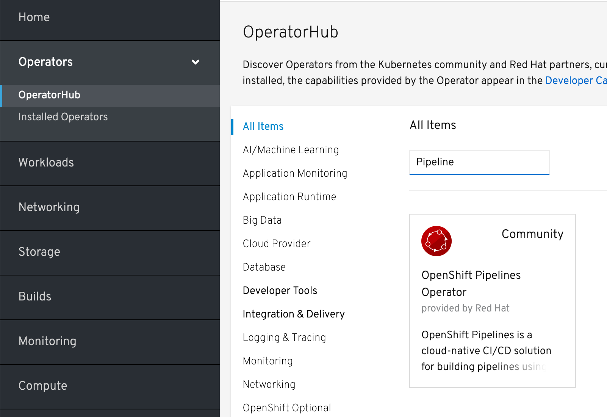\
3. A `Show Community Operator` dialog box will pop up, click Continue.
  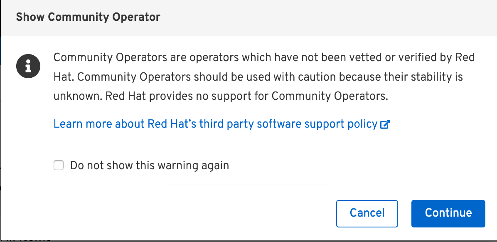
4. On the `OpenShift Pipelines Operator` screen, click Install.
  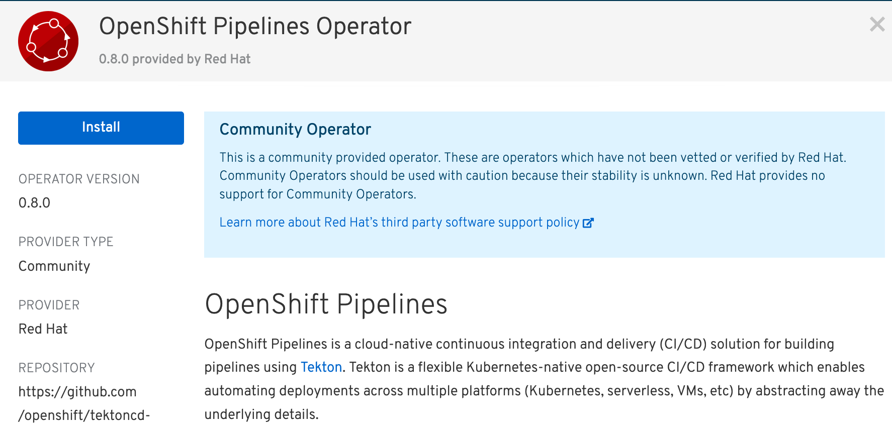
5. On the `Create Operator Subscription` page, ensure the `All namespaces on the cluster (default)` option is selected and click `Subscribe`.
  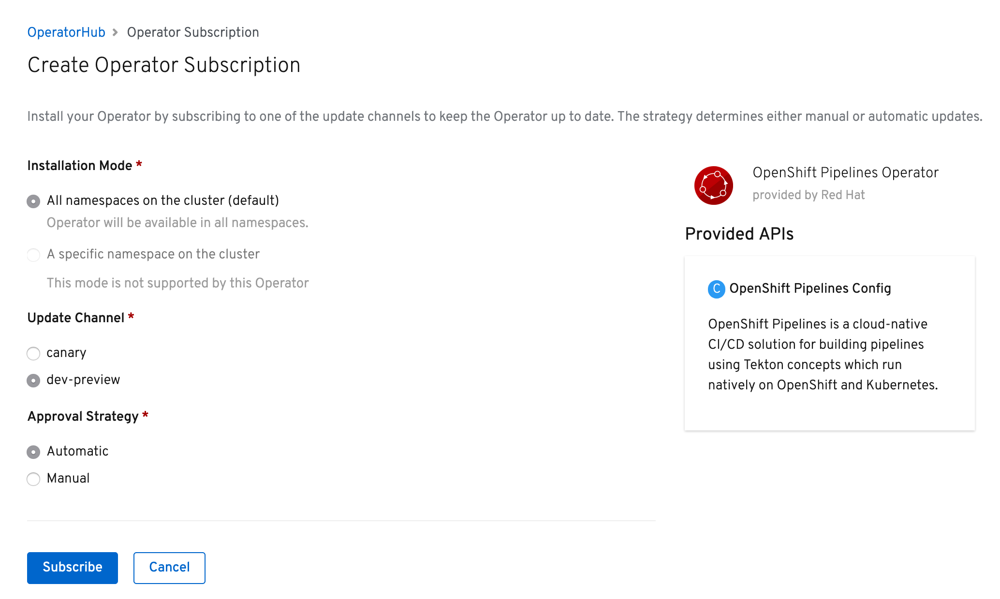
6. On the `Installed Operators` view, confirm the `OpenShift Pipeline Operator` has been deployed correctly.
  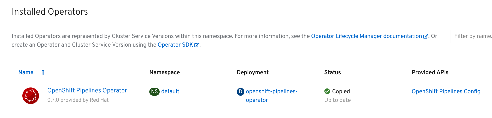


## Install Tekton Dashboard
Previous releases are available from [here](https://storage.googleapis.com/tekton-releases/).
1. Install [Tekton Dashboard](https://github.com/tektoncd/dashboard):
```
  # Create a new project called `tekton-pipelines`
  oc new-project tekton-pipelines

  # Install v0.3.0 of Tekton Dashboard
  kubectl apply --filename https://github.com/tektoncd/dashboard/releases/download/v0.3.0/dashboard-latest-openshift-tekton-dashboard-release.yaml --validate=false

  # Retrieve the Tekton Dashboard Route (ie. tekton-dashboard-tekton-pipelines.<cluster name>-ibm-<unique key>.us-south.containers.appdomain.cloud )
  oc get route
```
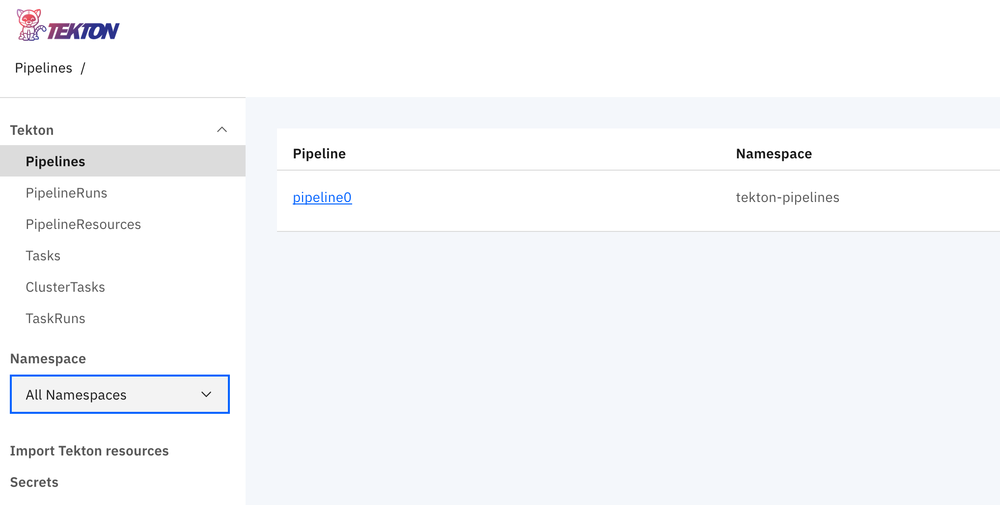
2. Install [Tekton Webhook Extension](https://github.com/tektoncd/experimental/blob/master/webhooks-extension/docs/InstallReleaseBuild.md):
```
  # Install v0.3.0 of Tekton Webhook Extension
  oc apply -f
  kubectl apply -f https://github.com/tektoncd/dashboard/releases/download/v0.3.0/openshift-tekton-webhooks-extension-release.yaml
```
**Note**: Starting in Tekton Webhook Extension v0.3.0, it no longer requires Knative.  Refresh the Tekton Dashboard URL and the Webhook option should be available now on the left hand menu.  If you experience an error viewing the Webhooks page on Firefox, try the Chrome browser.
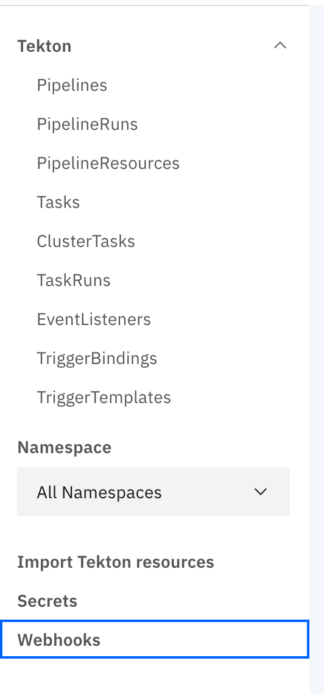


## Update the Web Deployment to pull images from IBM Container Registry instead of Dockerhub:
1. Create an API key for use by the service account to access the Registry.  Instruction are available in this [link](https://cloud.ibm.com/docs/iam?topic=iam-userapikey#create_user_key).

2. Validate the API key and push BlueCompute web docker image to the IBM Container Registry using your local Docker CLI.
```
# Log in to IBM Container Registry using the generated API key
docker login -u iamapikey -p <your_apikey> <registry_url>
    For namespaces set up in AP-North, use jp.icr.io
    For namespaces set up in AP-South, use au.icr.io
    For namespaces set up in EU-Central, use de.icr.io
    For namespaces set up in UK-South, use uk.icr.io
    For namespaces set up in US-South, use us.icr.io
```
![Docker Login]../../static/imgs/docker-login.png)

3. Log in to [IBM Cloud](https://cloud.ibm.com/), select OpenShift and click on Registry. Then click on namespaces and then click on create namespace and create a new user.
![IBM Container Registry]../../static/imgs/ibm-container-registry.png)

4. Pull the BlueCompute web image from Dockerhub
```
docker pull ibmcase/bluecompute-web:0.6.0
```
![Docker Pull from Dockerhub]../../static/imgs/docker-pull-image-dockerhub.png)

5. Tag the image with the IBM Container Registry URL.
```
docker tag ibmcase/bluecompute-web:0.6.0 us.icr.io/<user>/bluecompute-web:0.6.0
```
![Docker Tag]../../static/imgs/docker-tag.png)

6. Push the image to IBM Container Registry
```
docker push us.icr.io/<user>/bluecompute-web:0.6.0
```
![Docker Push]../../static/imgs/docker-push.png)

 Verify the image appears in the IBM Container Registry.
![IBM Container Registry]../../static/imgs/updated-ibm-container-registry.png)

7. Create an image pull secret with the API key.  Refer to this [link](https://cloud.ibm.com/docs/containers?topic=containers-images#other_registry_accounts) for detailed instructions.
```
# Create a docker-registry secret
kubectl --namespace <kubernetes_namespace> create secret docker-registry <secret_name> --docker-server=<registry_URL> --docker-username=iamapikey --docker-password=<api_key_value> --docker-email=<docker_email>
```

8. Update the default service account with the image pull secret.  Refer to this [link](https://cloud.ibm.com/docs/containers?topic=containers-images#use_imagePullSecret) for detailed instructions.
```
# Patch the default service account with the image pull secret
kubectl patch -n <namespace_name> serviceaccount/default --type='json' -p='[{"op":"add","path":"/imagePullSecrets/-","value":{"name":"<image_pull_secret_name>"}}]'
```

9. Update Bluecompute Web deployment with the image from IBM Container Registry.
  - From OpenShift console, click `bluecompute` project, select Application > Deployments and click on `web`.
  - Select Actions > Edit YAML and an inline editor will appear.  Search for `image: 'ibmcase/bluecompute-web:0.6.0'` and update the image reference to the image you uploaded to the IBM Container Registry (ie. "us.icr.io/<user>/bluecompute-web:0.6.0").  
  - Verify the pod is able to pull the image successfully.  You can monitor the termination of the existing pod for the web application and creation of a new pod using `kubectl get pods -w`.
  ![Update Deployment with new image]../../static/imgs/deployment-update-image.png)


## Create OpenShift Pipeline using S2I task:
1. Clone the BlueCompute Web repository.
  - Clone the [repository](https://github.com/hollisc/refarch-cloudnative-bluecompute-web) and push up the contents to your own repository.  This will be referenced by the Tekton pipeline further in this README.  
2. Clone the git repository for the Tekton yamls.  
```
git clone git@github.com:ibm-cloud-architecture/gse-devops.git
cd gse-devops
cd bluecompute-ce-openshift-pipelines
```  
3. Verify oc cli is set to use `bluecompute` project.
```
oc project
```
4. Create push secret.
```
# Create Kubernetes Secret
kubectl create secret generic ibm-cr-push-secret --type="kubernetes.io/basic-auth" --from-literal=username=iamapikey --from-literal=password=<API Key>
# Add annotation to the secret:
kubectl annotate secret ibm-cr-push-secret tekton.dev/docker-0=us.icr.io
```
5. Create a `pipeline-account` service account, role and rolebinding:
```
# Create the pipeline-account service account
kubectl apply -f pipeline-account.yaml
```
6. Create an image pull secret with the API key generated previously.
```
kubectl create secret docker-registry ibm-cr-pull-secret --docker-server=us.icr.io --docker-username=iamapikey --docker-password=<api_key_value>  --docker-email=<docker_email>
```
7. Update the `pipeline-account` service account with the image pull secret created.  
```
# Patch the default service account with the image pull secret
kubectl patch serviceaccount/pipeline-account --type='json' -p='[{"op":"add","path":"/imagePullSecrets/-","value":{"name":"ibm-cr-pull-secret"}}]'
```
8. Create a clusteradmin rolebinding for the `pipeline-account`.  **NOTE**: This should not be done in production and the service account should only be set with permissions required to update deployment resource.
```
# Create clusteradmin rolebinding
kubectl apply -f clusteradmin-rolebinding.yaml
```
9. Create a persistent volume for the Tekton pipeline.  If dynamic storage is not configured, a persistent volume will be required for the Tekton pipeline to proceed.  A sample yaml has been provided.
```
# Create a persistent volume
kubectl apply -f pv.yaml
```
10. Create the Task resources.
```
# Create the S2I Nodejs build task.  The original Task yaml is from the OpenShift Pipeline Catalog (https://github.com/openshift/pipelines-catalog) but has been modified to create an image based on a provided tag instead of using "latest"
kubectl apply -f Tasks/s2i-nodejs-task.yaml
# Create the deploy task
kubectl apply -f Tasks/deploy-using-kubectl.yaml
```
11. Create the PipelineResource resources.
```
# Update the Git repository URL and IBM Container Registry URL values.
 - Update the following values:
 us.icr.io/<user>/bluecompute-web  
 https://github.com/<Git Org>/refarch-cloudnative-bluecompute-web
# Create the git and image pipeline resources.
kubectl apply -f PipelineResources/bluecompute-web-s2i-pipeline-resources.yaml
```
12. Create the Pipeline resource.
```
# Create the Pipeline resource
kubectl apply -f Pipelines/s2i-build-and-deploy-pipeline.yaml
```
13. Verify the Tekton resources were created from the Tekton Dashboard.
```
# Get Tekton Dashboard URL
oc get route -n tekton-pipelines
```
 - Pipeline
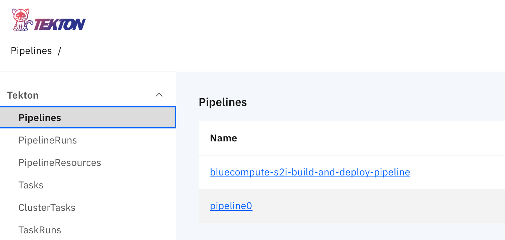
 - PipelineResources
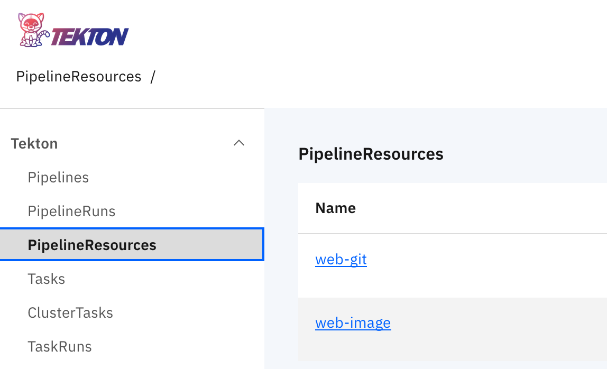
 - Tasks
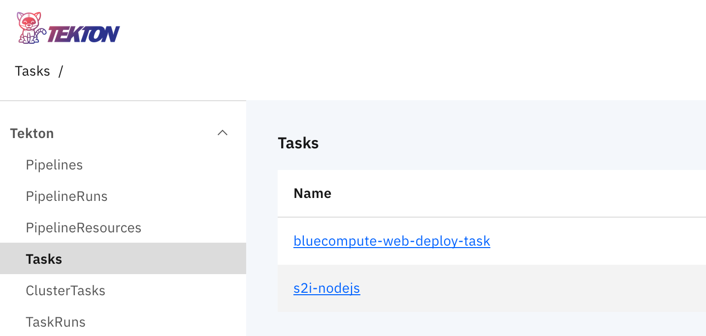
14. Create a persistent volume for Tekton Pipeline.
 - If your cluster does not have dynamic storage provisioning configured, you will need to create a Persistent Volume (PV)  For example, an OpenShift instance running on IBM Cloud will automatically create a persistent volume and persistent volume claim for the pipeline but you are using an on-prem OpenShift instance withouth dynamic storage, the pipelinerun will be pending since it is waiting for a persistent volume.  A sample `pv.yaml` has been included in the repo for usage.
 ```
 # Create persistent volume
 oc apply -f pv.yaml
 ```
15. Manually run the Tekton Pipeline.
 - Let's validate the various pieces of the OpenShift Pipeline works.  This can be achieved by a PipelineRun.  Before we kick off the pipeline, let's update `PipelineRuns/bluecompute-web-pipeline-run-s2i.yaml`.
 - Update the YAML with your IBM Container Registry URL by updating the value `us.icr.io/<user>/bluecompute-web`.
 - Start the pipeline by running the command:
`kubectl create -f PipelineRuns/bluecompute-web-pipeline-run-s2i.yaml`.  Note that the name of the pipelinerun resource is auto-generated (refer to metatdata.generateName property) so `kubectl apply` cannot be used otherwise an error will be thrown.
 - Description of the pod status during the execution of a Tekton pipeline.  
      * The `bluecompute-s2i-build-and-deploy-web-pipeline-run-wd4s4-b-8l4d5-pod-600309` pod is executing the build task.  It starts the pre-defined init containers followed by the steps defined in the Tekton Build Task.
      * The `bluecompute-s2i-build-and-deploy-web-pipeline-run-wd4s4-d-cl5ls-pod-edae05` pod is executing the deployment task.  It starts the init containers followed by the steps defined in the Tekton Deploy Task.
      * Once the deployment is complete, the existing `web` application pod is terminated and a new `web` pod is started referencing the new image that was created and pushed to the IBM Container Registry.
      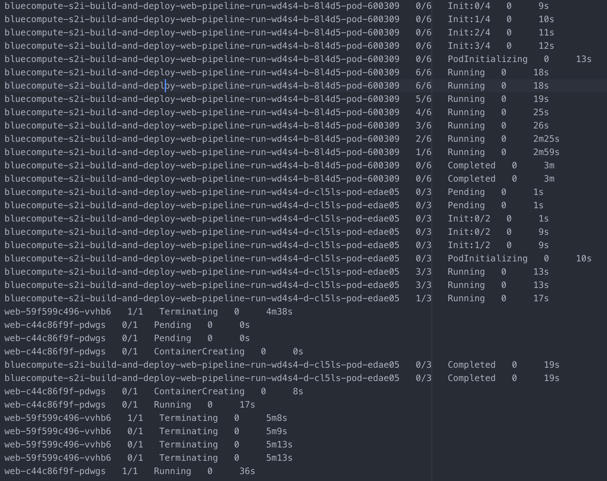


## Trigger OpenShift Pipeline using Developer View
1. Log on to the OpenShift 4.x Web Console
2. Select `Administrator` and in the drop down menu, click on the `Developer` view.

3. Select `Pipelines`, click on the options menu on the far right for the `bluecompute-s2i-build-and-deploy-pipeline` pipeline and click `Start`.

4. Provide values for `image-name` and `image-tag` parameters and click Start.
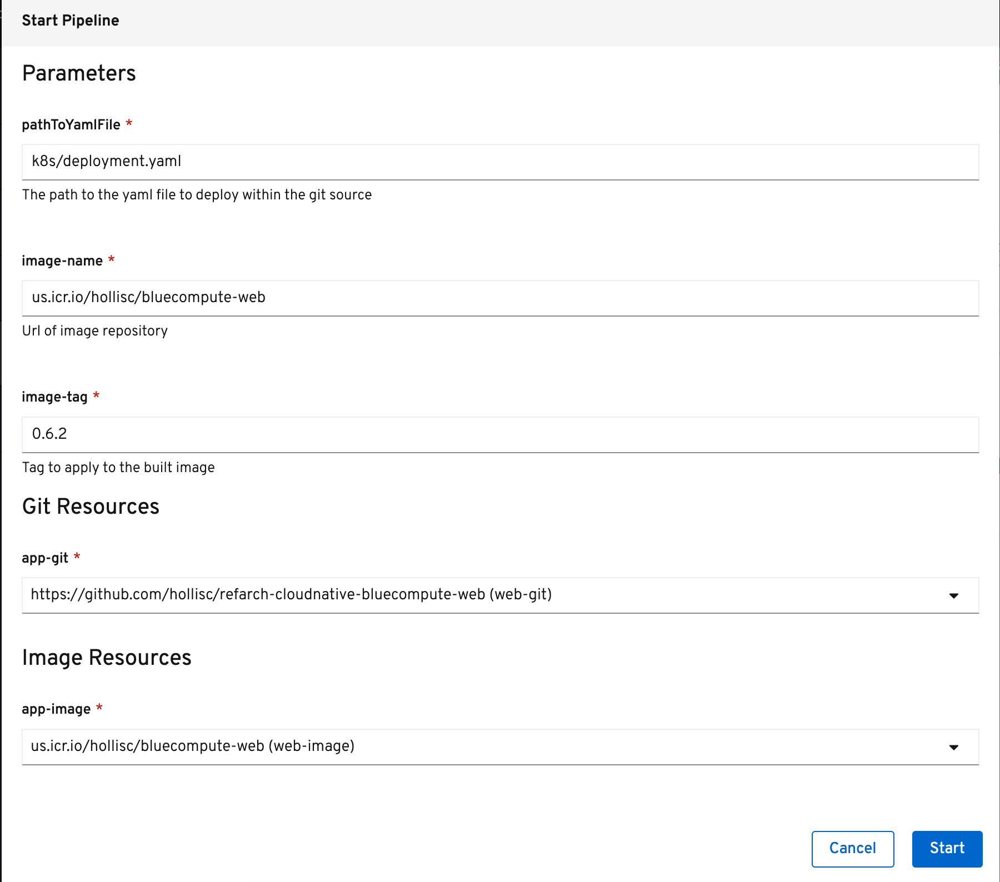
5. Click the triggered `PipelineRun` to view the status.
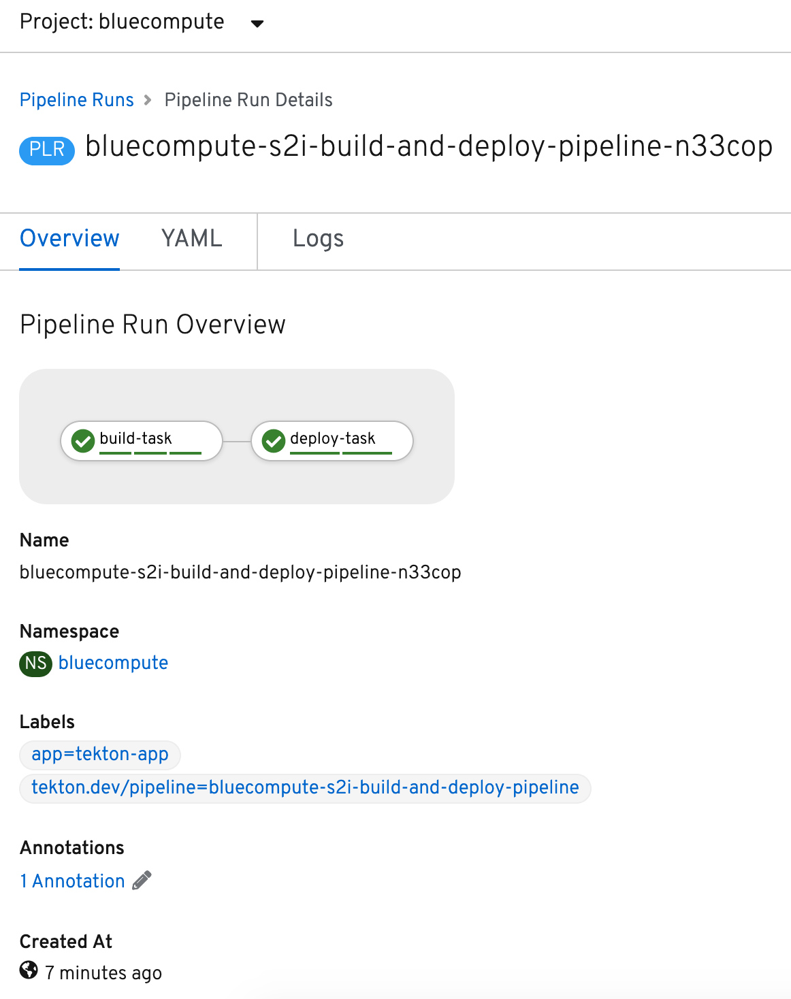


## Configure Tekton Github Webhook:
1. Generate and save the Github token.
 - Go to github.com/settings/tokens and click Generate new token.
 - Check the admin:repo_hook option and click Generate token.
2. Open the Tekton Dashboard in a browser and click on Webhooks item in the left hand menu and select "Add Webhook".
3. Create an `Access Token` by clicking on the `+` and specifying a name and the Github token generated in the previous step.

4. Fill in the fields similar to below but use your own Github repository and Docker Registry.  Click Create.
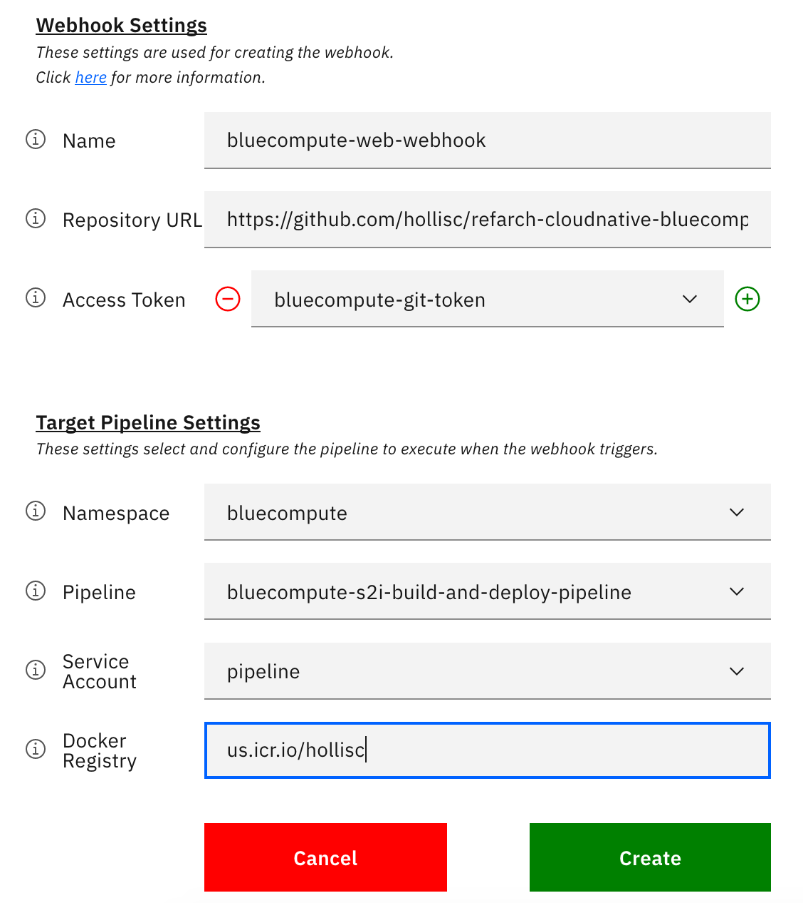
5. A Tekton Webhook has been configured.

6. As [Tekton Dashboard and Webhook Extension v0.3.0](https://github.com/tektoncd/dashboard/releases/tag/v0.3.0) is now based on [Tekton Triggers](https://github.com/tektoncd/triggers) and no longer dependent on Knative, TriggerBinding, TriggerTemplate and Condition custom resources will need to be created.
```
# Create the pull request binding
kubectl apply -f Triggers/bluecompute-s2i-build-and-deploy-pipeline-pullrequest-binding.yaml
# Create the push binding
kubectl apply -f Triggers/bluecompute-s2i-build-and-deploy-pipeline-push-binding.yaml
# Create the TriggerTemplate
kubectl apply -f Triggers/bluecompute-s2i-build-and-deploy-pipeline-template.yaml
# Create the Condition
kubectl apply -f Triggers/deployment-condition.yaml
```
7. Create a new Pipeline for Webhook triggered executions
```
# Create the Pipeline for webhooks
kubectl apply -f Pipelines/s2ibuild-and-deploy-pipeline-trigger-webhook.yaml
```


## Validate webhook by pushing in a change to the web application:
TBD


## Uninstall OpenShift Pipelines:
1. Log on to the OpenShift 4.x Web Console and navigate to Operators > Installed Operators.
2. On the Installed Operators screen, click `OpenShift Pipelines Operators`.
3. On the Operator Details screen, click Actions > Uninstall Operator.
  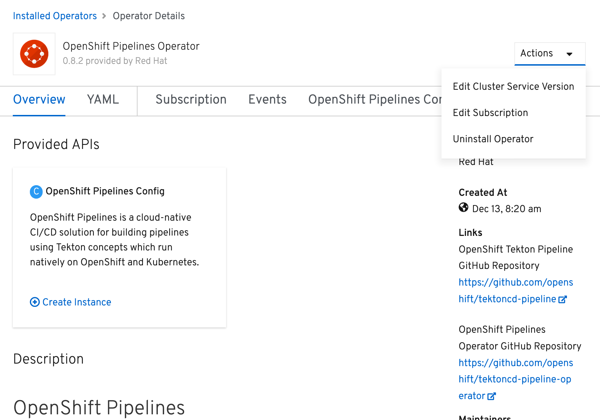


## Uninstall Tekton components:
```
# Delete Tekton Webhook Extension
oc delete -f https://github.com/tektoncd/dashboard/releases/download/v0.3.0/openshift-tekton-webhooks-extension-release.yaml
# Delete Tekton Dashboard
kubectl delete --filename https://github.com/tektoncd/dashboard/releases/download/v0.3.0/dashboard-latest-openshift-tekton-dashboard-release.yaml
```
