# Configure a Tekton Pipelines for Bluecompute Web application

This [README](../../bluecompute-ce-tekton-pipelines/web/README.md) is a follow on to deploying [bluecompute-ce](../../bluecompute-ce/README.md) on an OpenShift cluster and will focus on three activities:

1. Configure the BlueCompute Web app deployment to pull images from the IBM Container Registry.
2. Configure and manually validate a Tekton CICD pipeline.
3. Configure a Tekton Webhook to trigger the pipeline upon a push.


## Requirements:
- A deployed OpenShift cluster.
- Install Git CLI `git`, Docker CLI `docker`, Kubernetes CLI `kubectl`, and OpenShift CLI `oc`.
- Deploy `bluecompute-ce` reference application - [Instructions](../../bluecompute-ce/README.md).


## Install Tekton Pipeline, Dashboard and Webhook extension
Previous releases for all three components are available [here](https://storage.googleapis.com/tekton-releases/).

1. Install [Tekton Pipelines](https://github.com/tektoncd/pipeline/blob/master/docs/install.md):
```
  # Create a new project called `tekton-pipelines`
  oc new-project tekton-pipelines

  # The `tekton-pipelines-controller` service account needs the `anyuid` security context constraint in order to run the webhook pod.  
  oc adm policy add-scc-to-user anyuid -z tekton-pipelines-controller

  # Install latest version of Tekton Pipelines
  oc apply --filename https://storage.googleapis.com/tekton-releases/latest/release.yaml
```

2. Install [Tekton Dashboard](https://github.com/tektoncd/dashboard):
```
  # Install v0.2.0 of Tekton Dashboard
  kubectl apply --filename https://github.com/tektoncd/dashboard/releases/download/v0.2.0/openshift-tekton-dashboard.yaml --validate=false

  # Retrieve the Tekton Dashboard Route (ie. tekton-dashboard-tekton-pipelines.<cluster name>-ibm-<unique key>.us-south.containers.appdomain.cloud )
  oc get route
```


3. Install [Tekton Webhook Extension](https://github.com/tektoncd/experimental/blob/master/webhooks-extension/docs/InstallReleaseBuild.md):
```
  # Install latest version of Tekton Webhook Extension
  oc apply -f https://github.com/tektoncd/dashboard/releases/download/v0.2.0/openshift-webhooks-extension.yaml
```
**Note**: Refresh the Tekton Dashboard URL and the Webhook option should be available now on the left hand menu.  If you experience an error viewing the Webhooks page on Firefox, try the Chrome browser.


## Update the Web deployment to pull images from IBM Container Registry instead of Dockerhub:
1. Create an API key for use by the service account to access the Registry.  Instruction are available in this [link](https://cloud.ibm.com/docs/iam?topic=iam-userapikey#create_user_key).

2. Validate the API key and push BlueCompute web docker image to the IBM Container Registry using your local Docker CLI.
```
# Log in to IBM Container Registry using the generated API key
docker login -u iamapikey -p <your_apikey> <registry_url>
    For namespaces set up in AP-North, use jp.icr.io
    For namespaces set up in AP-South, use au.icr.io
    For namespaces set up in EU-Central, use de.icr.io
    For namespaces set up in UK-South, use uk.icr.io
    For namespaces set up in US-South, use us.icr.io
```


3. Log in to [IBM Cloud](https://cloud.ibm.com/), select OpenShift and click on Registry. Then click on namespaces and then click on create namespace and create a new user.


4. Pull the BlueCompute Web image from Dockerhub
```
docker pull ibmcase/bluecompute-web:0.6.0
```
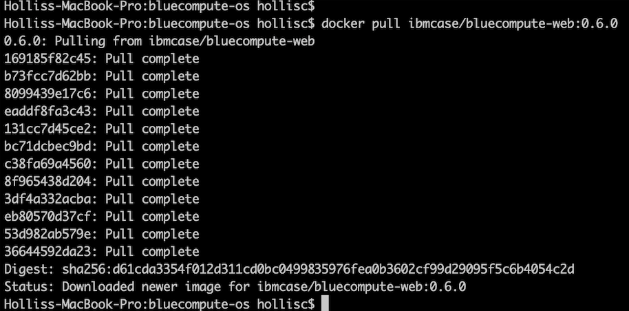

5. Tag the image with the IBM Container Registry URL.
```
docker tag ibmcase/bluecompute-web:0.6.0 us.icr.io/<user>/bluecompute-web:0.6.0
```
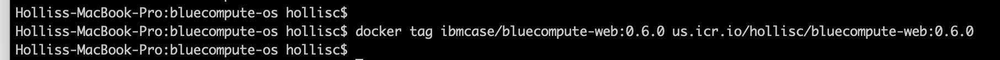

6. Push the image to IBM Container Registry
```
docker push us.icr.io/<user>/bluecompute-web:0.6.0
```
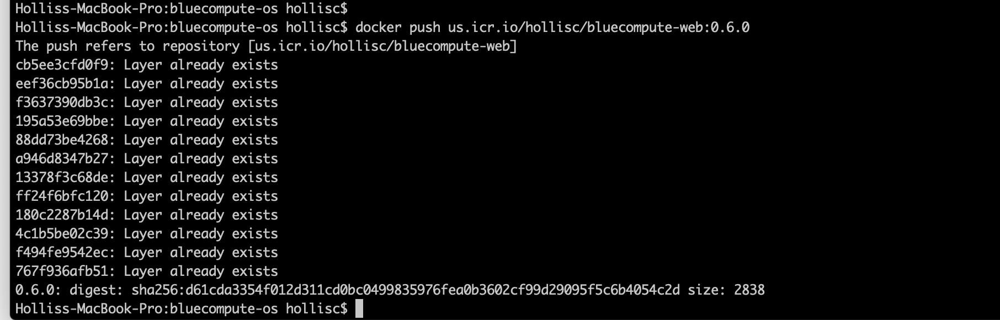

 Verify the image appears in the IBM Container Registry.
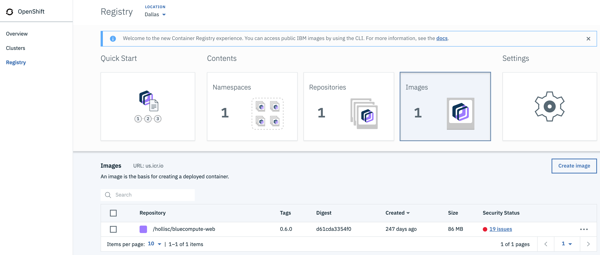

7. Create an image pull secret with the API key.  Refer to this [link](https://cloud.ibm.com/docs/containers?topic=containers-images#other_registry_accounts) for detailed instructions.
```
# Create a docker-registry secret
kubectl --namespace <kubernetes_namespace> create secret docker-registry <secret_name> --docker-server=<registry_URL> --docker-username=iamapikey --docker-password=<api_key_value> --docker-email=<docker_email>
```

8. Update the default service account with the image pull secret.  Refer to this [link](https://cloud.ibm.com/docs/containers?topic=containers-images#use_imagePullSecret) for detailed instructions.
```
# Patch the default service account with the image pull secret
kubectl patch -n <namespace_name> serviceaccount/default --type='json' -p='[{"op":"add","path":"/imagePullSecrets/-","value":{"name":"<image_pull_secret_name>"}}]'
```

9. Update Bluecompute Web deployment with the image from IBM Container Registry.
  - From OpenShift console, click `bluecompute` project, select Application > Deployments and click on `web`.
  - Select Actions > Edit YAML and an inline editor will appear.  Search for `image: 'ibmcase/bluecompute-web:0.6.0'` and update the image reference to the image you uploaded to the IBM Container Registry (ie. `us.icr.io/< user >/bluecompute-web:0.6.0`).  
  - Verify the pod is able to pull the image successfully.  You can monitor the termination of the existing pod for the web application and creation of a new pod using `kubectl get pods -w`.
  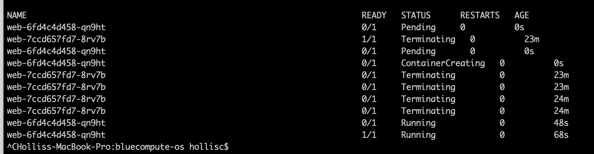


## Create Tekton Pipeline for the Web application:
1. Fork the BlueCompute Web microservice repository.  This will create a repository under your own Git account. This repository will be referenced by the Tekton pipeline further in this README.
    - Web [repository-web](https://github.com/ibm-cloud-architecture/refarch-cloudnative-bluecompute-web)
    - A Kubernetes deployment yaml is required for the CD portion of the pipeline so clone the forked microservice, **switch to the spring branch** and created a folder name "k8s".  Within this folder, create a new filed called `deployment.yaml`, copy and paste the content from the corresponding web repository into the file and push the changes to your repository.
      - Web [repository-web](https://github.com/hollisc/refarch-cloudnative-bluecompute-web/blob/spring/k8s/deployment.yaml)
2. Clone the [repo](https://github.com/ibm-cloud-architecture/gse-devops.git)  for the Tekton yamls.  
```
git clone git@github.com:ibm-cloud-architecture/gse-devops.git
cd gse-devops
cd bluecompute-ce-tekton-pipelines
cd web
```  
3. Verify oc cli is set to use `bluecompute` project.
```
oc project
```
4. Create push secret.
```
# Create Kubernetes Secret
kubectl create secret generic ibm-cr-push-secret --type="kubernetes.io/basic-auth" --from-literal=username=iamapikey --from-literal=password=<API Key>
# Add annotation to the secret:
kubectl annotate secret ibm-cr-push-secret tekton.dev/docker-0=us.icr.io
```
5. Create a `pipeline-account` service account, role and rolebinding:
```
# Create the pipeline-account service account
kubectl apply -f pipeline-account.yaml
```
6. Create an image pull secret with the API key generated previously.
```
kubectl create secret docker-registry ibm-cr-pull-secret --docker-server=us.icr.io --docker-username=iamapikey --docker-password=<api_key_value>  --docker-email=<docker_email>
```
7. Update the `pipeline-account` service account with the image pull secret created.  
```
# Patch the default service account with the image pull secret
kubectl patch serviceaccount/pipeline-account --type='json' -p='[{"op":"add","path":"/imagePullSecrets/-","value":{"name":"ibm-cr-pull-secret"}}]'
```
8. Create a clusteradmin rolebinding for the `pipeline-account`.  **NOTE**: This should not be done in production and the service account should only be set with permissions required to update deployment resource.
```
# Create clusteradmin rolebinding
kubectl apply -f clusteradmin-rolebinding.yaml
```
9. Create the Task resources.
```
# Create the build task
kubectl apply -f Tasks/source-to-image.yaml
# Create the deploy task
kubectl apply -f Tasks/deploy-using-kubectl.yaml
```
10. Create the PipelineResource resources.
```
# Update the Git repository URL and IBM Container Registry URL values.
 - Update the following values:
 us.icr.io/<user>/bluecompute-web  
 https://github.com/<Git Org>/refarch-cloudnative-bluecompute-web
# Create the git and image pipeline resources.
kubectl apply -f PipelineResources/bluecompute-web-pipeline-resources.yaml
```
11. Create the Pipeline resource.
```
# Create the Pipeline resource
kubectl apply -f Pipelines/build-and-deploy-pipeline.yaml
```
12. Verify the Tekton resources were created from the Tekton Dashboard.
```
# Get Tekton Dashboard URL
oc get route -n tekton-pipelines
```
 - Pipeline
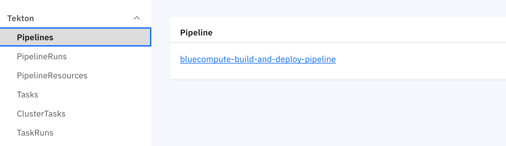
 - PipelineResources
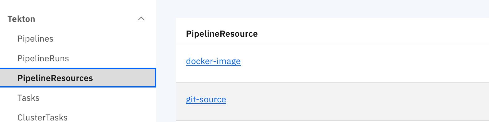
 - Tasks

13. Manually run the Tekton Pipeline.
 - Let's validate the various pieces of the Tekton pipeline works.  This can be achieved by a PipelineRun.  Before we kick off the pipeline, let's update `PipelineRuns/bluecompute-web-pipeline-run.yaml`.
 - Update the YAML with your IBM Container Registry URL by updating the value `us.icr.io/<user>/bluecompute-web`.
 - Start the pipeline by running the command:
`kubectl create -f PipelineRuns/bluecompute-web-pipeline-run.yaml`.  Note that the name of the pipelinerun resource is auto-generated (refer to metatdata.generateName property) so `kubectl apply` cannot be used otherwise an error will be thrown.
 - Description of the pod status during the execution of a Tekton pipeline.  
      * The `bluecompute-web-pr-5522c-build-task-*` pod is executing the build task.  It starts the pre-defined init containers followed by the steps defined in the Tekton Build Task.
      * The `bluecompute-web-pr-5522c-deploy-task-*` pod is executing the deployment task.  It starts the init containers followed by the steps defined in the Tekton Deploy Task.
      * Once the deployment is complete, the existing `web` application pod is terminated and a new `web` pod is started referencing the new image that was created and pushed to the IBM Container Registry.
      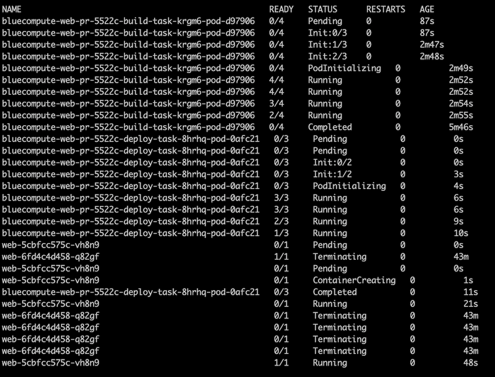


## Configure Tekton Github Webhook:
1. Generate and save the Github token.
 - Go to github.com/settings/tokens and click Generate new token.
 - Check the admin:repo_hook option and click Generate token.
2. Open the Tekton Dashboard in a browser and click on Webhooks item in the left hand menu and select "Add Webhook".
3. Create an `Access Token` by clicking on the `+` and specifying a name and the Github token generated in the previous step.

4. Fill in the fields similar to below but use your own Github repository and Docker Registry.  Click Create.
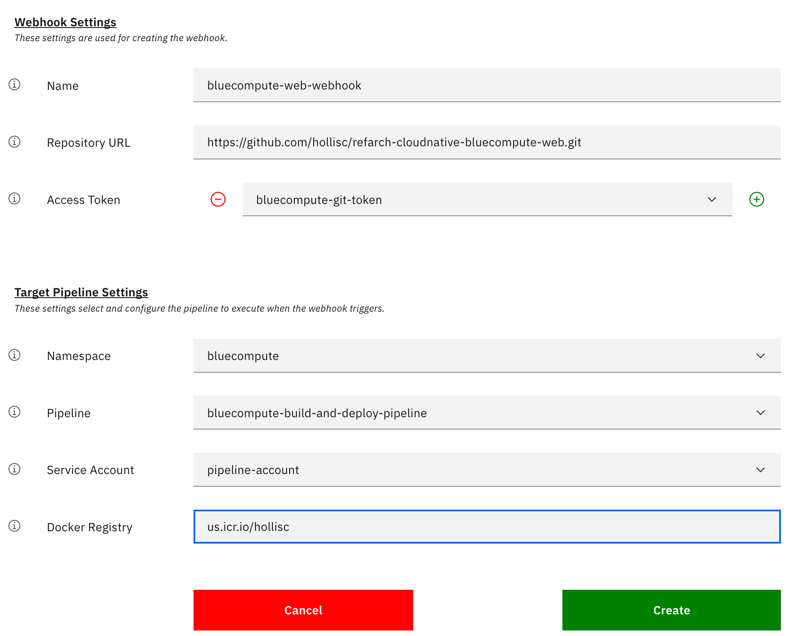
5. A Tekton Webhook has been configured.
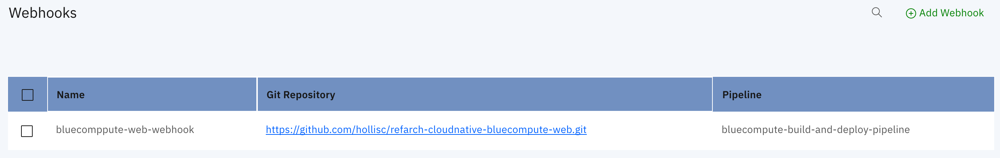


## Validate webhook by pushing in a change to the Web application:
```
Currently there is an open bug related to timing issue that causes PipelineRuns to fail if the creation of the PipelineResources are not completed in time.  
This is tracked via https://github.com/tektoncd/experimental/issues/240.
```
1. Clone the forked bluecompute-web github repository from earlier.
```
git clone https://github.com/<Your Git Org>/refarch-cloudnative-bluecompute-web
cd refarch-cloudnative-bluecompute-web
```
2. Make a change to the web application homepage and commit the change.
  - Edit the homepage (/StoreWebApp/public/resources/components/views/home.html) and save your change.
  - Verify your change is detected with `git status`
  - Commit your change `git commit -am "Update homepage"`
  - Push the change to the `spring` branch `git push origin spring`
  - Monitor the pods in the "bluecompute" project and verify a PipelineRun was triggered and a new `web` application pod is started.
  `kubectl get pods -w -n bluecompute`

   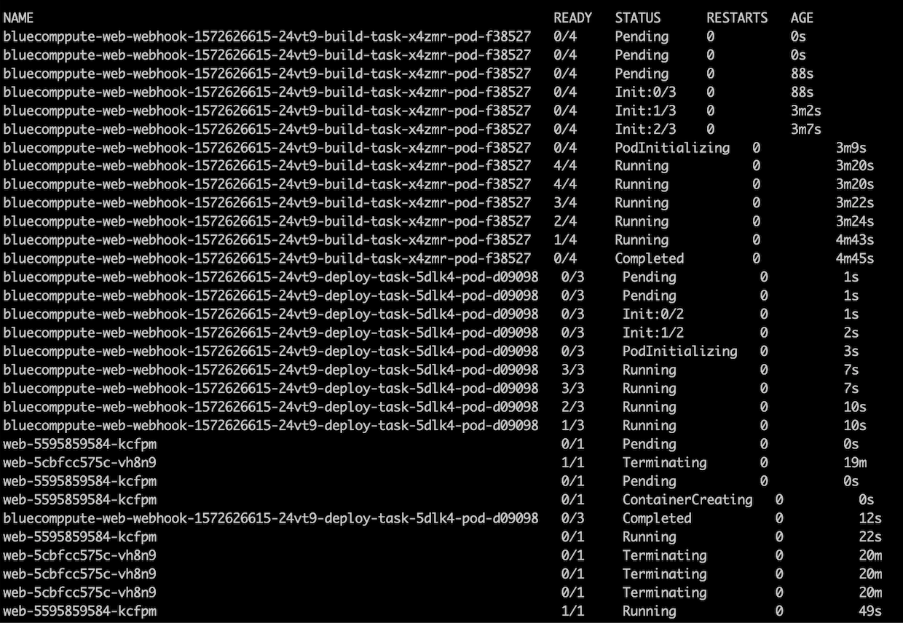
  - Alternatively, one can monitor the webhook triggered pipelinerun from the Tekton Dashboard as well.

      - PipelineRun View:
      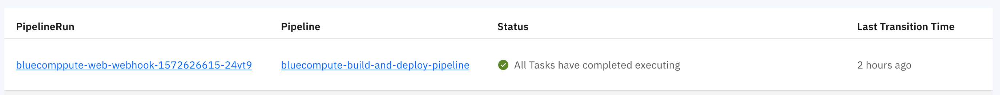
      - TaskRun View:
      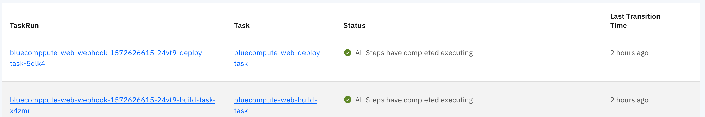


## Uninstall Tekton components:
```
# Delete Tekton Webhook Extension
oc delete -f https://github.com/tektoncd/dashboard/releases/latest/download/openshift-webhooks-extension.yaml
# Delete Tekton Dashboard
kubectl delete --filename https://github.com/tektoncd/dashboard/releases/download/v0.2.0/openshift-tekton-dashboard.yaml
# Delete Tekton Pipeline
oc delete --filename https://storage.googleapis.com/tekton-releases/latest/release.yaml
```
