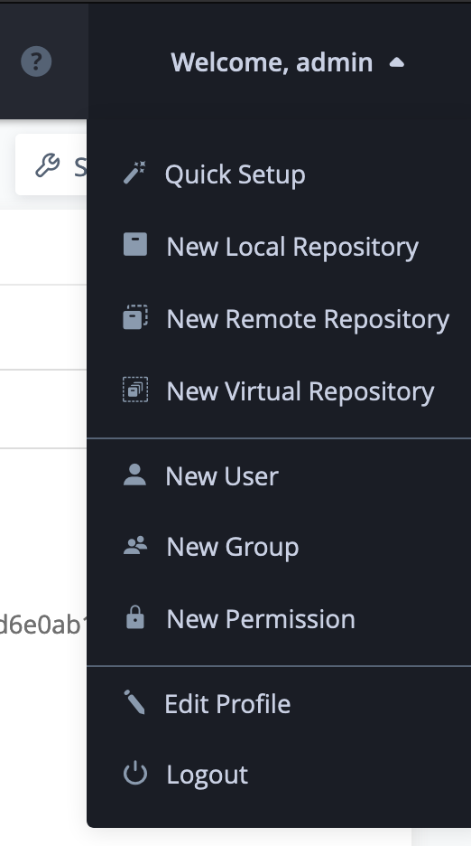
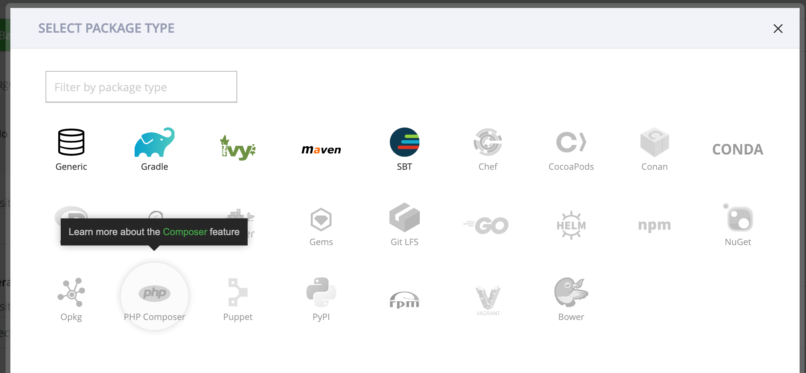
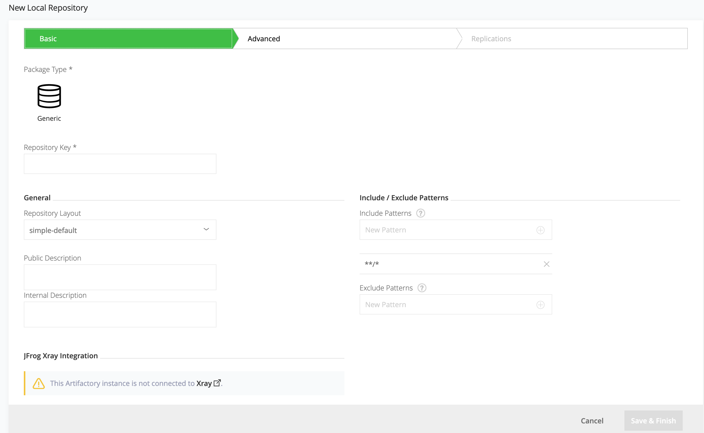

# Configure OpenShift Pipeline for App Connect Enterprise Deployments (Work in progress)

This [README](../../cloudpak-for-integration-tekton-pipelines/README.md) provides a working sample of a CICD pipeline involving the following steps:

1. Compile and create a bar based on an ACE Toolkit project.
2. Build an ACE-only server image containg the bar file and push it into the IBM Container Registry.
3. Deploy the newly built image of the ACE-only server + bar into an OpenShift cluster.

This tutorial uses the ACE pipeline created by our fellow GSE GSE colleagues in the Integration squad (https://github.ibm.com/rsundara/cp4i-ace-server).

Reference links:
- App Connect Enterprise Git Repo: https://github.com/ot4i/ace-docker
- ACE Server Helm Chart in the IBM Entitled Registry: https://github.com/IBM/charts/tree/master/entitled/ibm-ace-server-icp4i-prod
- ACE Server Image on Dockerhub: https://hub.docker.com/r/ibmcom/ace


## Requirements:
- Install the Git CLI `git`, Docker CLI `docker`, Kubernetes CLI `kubectl`, OpenShift CLI `oc`, Helm CLI `helm` and `cloudctl` CLI.
- Inventory microservice from the Bluecompute application deployed to an OpenShift / Kubernetes cluster with the service exposed as a route / ingress. This will be required by the sample BAR file. Additional instructions will be provided (TBD)


## Provision OpenShift 4.x cluster
OpenShift clusters can be provisioned on various Cloud providers or on-prem infrastructure.  In this demo, we will be using a Managed OpenShift cluster on IBM Cloud.

The OpenShift 4.2 installation [documentation](https://docs.openshift.com/container-platform/4.2/welcome/index.html) provides installation instructions.  

Our fellow GSE colleagues have also published instructions to install OpenShift 4.x on-prem.
  - [Installing OpenShift 4.x on VMware Virtual Infrastructure](https://github.com/ibm-cloud-architecture/refarch-privatecloud/blob/master/Install_OCP_4.x.md)


## Install OpenShift Pipeline Operator
OpenShift Pipelines is a Kubernetes native solution based on Tekton and provides an opinionated CI/CD experience with tight integration to OpenShift and RedHat developer tools.  It is currently available as a `Developer Preview release` and installation instruction can be found in this [link](https://openshift.github.io/pipelines-docs/docs/0.10.5/index.html).
1. Log on to the OpenShift 4.x Web Console and navigate to Operators > OperatorHub.
2. Search for `pipeline` and click on the `OpenShift Pipelines Operator`.
  \
3. A `Show Community Operator` dialog box will pop up, click Continue.
  
4. On the `OpenShift Pipelines Operator` screen, click Install.
  
5. On the `Create Operator Subscription` page, ensure the `All namespaces on the cluster (default)` option is selected and click `Subscribe`.
  
6. On the `Installed Operators` view, confirm the `OpenShift Pipeline Operator` has been deployed correctly.
  


## Install Tekton Dashboard
Previous releases are available from [here](https://storage.googleapis.com/tekton-releases/).
1. Install [Tekton Dashboard](https://github.com/tektoncd/dashboard):
```
  # Create a new project called `tekton-pipelines`
  oc new-project tekton-pipelines

  # Install v0.5.3 of Tekton Dashboard as this is compatible with Kubernetes clusters < 1.15.0
  kubectl apply --filename https://github.com/tektoncd/dashboard/releases/download/v0.5.3/openshift-tekton-dashboard-release.yaml  --validate=false

  # Retrieve the Tekton Dashboard Route
  oc get route -n tekton-pipelines
```


# Artifactory

1. Install Artifactory via the Garage Cloud Native toolkit. See [here](https://cloudnativetoolkit.dev/) for more info.

2. Artifactory is an optional route as we have two different pipelines that utilize either artifactory or git as a repo for the bar files. All the images are however sent to a private image repository.

### Warning:
In order to fully utilize the Artifactory API system, you will need the pro license. There are certain calls that are not enabled with the free version like creating a local repository. You will instead need to create the local repo via the gui. 

#### Creating a Local Repository

1. *This procedure will follow the non pro license method as pro license holders can simply utilize Artifactory's API calls to make a local repo.*
Click on the Welcome dropdown menu at the far top right of the Artifactory gui. 

2. Click on the New Local Repository link in the menu.


3. Click on the type of repo you will need. I will be using generic for this entire demo as file holding is what I need.


4. Fill in the basic information for the repository. The Repository Key is simply the name of the repository and will be what is referenced in all the curl calls to this repo.


5. Click on save and finish to publish the repo.

#### Curl calls to the repo

*I will be covering the curl calls to put and get files into a generic repository*

1. To put a file to the repository, you will need to decide an auth method to access your artifactory repo. You can use the basic auth method of your username and password or you can pass in a dedicated header with an API key. I will be using the dedicated header `X-JFrog-Art-Api`. You can also pass in shasums of the files being transfered with the `X-Checksum-Sha#` header.

```
        curl -H "X-JFrog-Art-Api:<api_key>" -X PUT "<artifactory_repo_path>/<artifact_name> -T <path_to_file>
```

2. To get a file from a repository, you will need a get call.
```
      curl -H "X-JFrog-Art-Api:<api_key>" -X GET "<artifactory_repo_path>/<artifact_name>" --output <name_the_file>
```

## Configure Namespace for ACE deployment
1. Create a project for the ACE deployment
```
# Create a new project
oc create new-project <project>
```
2. Add Security Context Constraints (SCC) to the default service account
```
# Add SCC Policy
oc adm policy add-scc-to-user anyuid system:serviceaccount:<project>:default
oc adm policy add-scc-to-user privileged system:serviceaccount:<project>:default
```

3. Add Service Account permissions to default service account
```
# Adding cluster view role to default service account
oc policy add-role-to-user view system:serviceaccount:as-ace:default
```

## Clone the required Git repositories
1. Clone the repository containing the sample ACE Toolkit workspace:
```
git clone git@github.com:ibm-cloud-architecture/devops-demo-sample-ace-project.git
```
2. Clone the repository containing the sample Tekton yamls:
```
git clone git@github.com:ibm-cloud-architecture/gse-devops.git
```

## Configure Secrets required by the pipeline
The Tekton pipeline will require credentials to clone Github Enterprise repositories, credential to authenticate to the Cloud Pak for Integration and also credentials to push and/or pull images from an image registry.  
Step 2 - 4 can also be accomplished via the Tekton Dashboard.
1. Update `common-settings`:
```
# Modify the Secret/ace-server-secrets.yaml
cd gse-devops/cloudpak-for-integration-tekton-pipelines/Tekton-YAMLs/


# For the common-settings Secret, base64 encode the following values:
    username: <BASE64 ENCODE USERID FOR ACCESSING CLOUD PAK FOR INTEGRATION>
    password: <BASE64 ENCODE PASSWORD FOR ACCESSING CLOUD PAK FOR INTEGRATION>
    url: <<BASE64 ENCODE URL FOR ICP CONSOLE URL>
    cloudType: <BASE64 ENCODE ("ibmcloud" or "onprem")>
    offlineInstall: <BASE64 ENCODE TRUE OR FALSE>
    fileStorage: <BASE64 ENCODE "nfs" or "csi-cephfs" or "ibmc-file-gold" or "any RWX storage provider">
```
2. Update `git-secret`:
```
# For the git-secret, base64 encode the following values:
    password: <BASE64_ENCODE(API_KEY)>
    username: <BASE64_ENCODE(GIT_USER_NAME)>
```
3. Update `docker-secret`:
```
    username: <USERID_USED_TO_LOGIN_TO_OPENSHIFT_CLUSTER>
    password: <PASSWORD_TO_LOGIN_TO_OPENSHIFT_CLUSTER>
```
4. Create the Secrets in the cluster:
```
oc apply -f Secret/ace-server-secret.yaml -n <project>
```
5. Update the `pipeline` service account with the `git-secret` and `docker-secret`
```
# Add "docker-secret" and "git-secret" to "pipeline" service account:
oc edit sa pipeline -n <project>

# Under the "secrets" section, add entries referencing the git and docker secrets

secrets:
- name: pipeline-token-xxxxxx
- name: pipeline-dockerxxxxxx
- name: docker-secret
- name: git-secret
```


## Configure Tekton PipelineResources
The Tekton pipeline will require PipelineResources as input and output in order to execute.  For example, for the ACE server deployment pipeline, the input would be referencing a Git repository containing the ACE Toolkit workspace artifacts.  Similarly, one of the outputs expected when the pipeline is complete is an image of the ACE Server with the newly built BAR file.
1. Update `cp4i-build-image` with the URL of the expected ACE server image to be created.
```
value: image-registry.openshift-image-registry.svc:5000/<namespace>/<image name>

# If using a private registry, such as the IBM Container Registry, the URL would be:
value: us.icr.io/<namespace>/<repository>:<tag>
```
2. Update `cp4i-ace-server-source` with the URL of the target Git repo
```
value: <Github repo URL>

# For this tutorial, we will be using the following repoitory
value: https://github.com/ibm-cloud-architecture/devops-demo-sample-ace-project
```
3. Create the PipelineResources in the cluster:
```
oc apply -f PipelineResources/ace-server-resources.yaml -n <project>
```


## Create ACE Server pipeline
1. Create the Tekton Pipeline and Task resources
```
oc apply -f Pipelines-Tasks/
```
2. From the Tekton Dashboard, validate that the ACE Server Pipelines and Tasks appears in the <project> namespace.


## Manually Trigger the ACE Tekton Pipeline from the Tekton dashboard
1. From the Tekton dashboard, select PipelineRuns and click the `Create` button.
2. In the Create PipelineRun window, provide the following values and click Create.
```
Namespace: <project>
Pipeline: ace-server-deploy
PipelineResources:
  git-source: cp4i-ace-server-source
  image: cp4i-build-image
Params:
  project: <Name of ACE Toolkit project being built>
  buildversion: Tag of the image being built
  env: dev
  production: Specifies if the deployment is production-like with High Availability enabled. It is set to false by default.
Service Account: default
```
<!-- ##Pushing to APIC
1. Set the variables: json_link(link to json file in ace server), server(url to the cluster), realm(see the docs for different options but default should be "admin/default-idp-1"), and spaces(list of urls can be called with "apic spaces:list").
2. Docker image is set to run 4 different apic commands which are apic login, apic config set for spaces, apic create product, and apic publish product.

```
Warning: Currently, this section is failing as a simple json to yaml conversion is failing with the apic publish command for two reasons. The scheme default is currently set to http when it should be https and there are api calls not included in the multipart 'openapi' request payload. 
``` -->
## Configure Tekton Github Webhook:
TBD

## Validate webhook by pushing in a change to the web application:
TBD


## Uninstall OpenShift Pipelines:
1. Log on to the OpenShift 4.x Web Console and navigate to Operators > Installed Operators.
2. On the Installed Operators screen, click `OpenShift Pipelines Operators`.
3. On the Operator Details screen, click Actions > Uninstall Operator.
  


## Uninstall Tekton components:
```
# Delete Tekton Dashboard
kubectl delete --filename https://github.com/tektoncd/dashboard/previous/v0.5.3/openshift-tekton-dashboard-release.yaml
```
